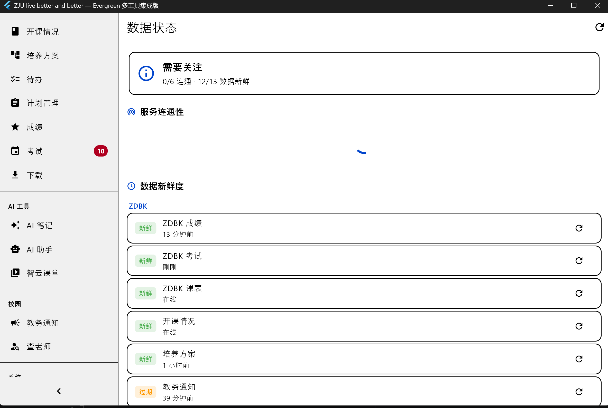

# PR_history/2026-06-16-v1.1-release.md

## 修改目的

**版本**: v1.0.0 → v1.1.0（+1 因新增数据状态管理系统）

回应 ISSUE "[by 用户：匿名U001][一般] 状态同步延迟，自动连接可优化，端口时常断开"：
- "状态同步延迟" → 前端永远读缓存，毫秒级响应
- "自动连接可优化" → 13 源数据状态面板，一键全量/单源刷新
- "端口时常断开" → 网络失败自动回退过期缓存，离线可用

### 核心理念
- **前端永远读缓存，不触发网络请求**
- **后台静默拉取全部数据，写入缓存**
- **用户手动刷新时更新缓存，失败回退旧缓存**
- **数据状态面板统一展示连通性 + 新鲜度**

---

## 修改文件清单

### 新增文件（7 个）
| 文件 | 说明 |
|------|------|
| `lib/core/connectivity/data_status_manager.dart` | 数据源状态管理器（13 个源） |
| `lib/core/services/background_refresher.dart` | 后台静默全量刷新器 |
| `lib/widgets/freshness_badge.dart` | 数据新鲜度徽章组件 |
| `PR_history/2026-06-16-架构六项改进.md` | 本文件 |
| `test/core/connectivity/data_status_test.dart` | DataStatusManager 单元测试 |
| `test/widgets/freshness_badge_test.dart` | FreshnessBadge 组件测试 |
| `test/features/agent/cache_first_datasource_test.dart` | Agent 缓存优先测试 |

### 修改文件（20 个）

**缓存层**
| 文件 | 改动 |
|------|------|
| `lib/core/storage/database.dart` | +`CacheTtl.notifications`(30min) / `CacheTtl.trainingPlans`(24h)；+`instanceOrNull` / `getCacheTimestamp()` |
| `lib/features/zdbk/services/zdbk_service.dart` | `getTrainingPlans` +缓存写入 +fallbackKey；`getNotifications` 改为 `_withAutoRelogin` +缓存 +fallbackKey |
| `lib/features/courses/services/courses_api_service.dart` | `getMyCourses()`/`getAllExams()` 网络错误时回退 stale cache |
| `lib/features/classroom/services/classroom_crawler.dart` | `listCourses()` 写入 `classroom_courses` 文件缓存 +失败回退 |

**Agent 层**
| 文件 | 改动 |
|------|------|
| `lib/features/agent/providers/agent_provider.dart` | `FlutterZjuDataSource` 重构：+`WebCacheDatabase`/`CacheManager` 依赖，所有方法 cache-only（仅 searchCourseOfferings/getPlanOcrText 除外） |
| `lib/core/agent/tools/zju_courses.dart` | 空数据提示加"请先在数据状态面板刷新" |
| `lib/core/agent/tools/zju_scores.dart` | 空数据提示改为"Agent 使用本地缓存" |
| `lib/core/agent/tools/zju_timetable.dart` | 空数据提示加"请先在数据状态面板刷新" |

**Provider 层**
| 文件 | 改动 |
|------|------|
| `lib/features/courses/providers/courses_provider.dart` | `courseFullDataProvider` +`.autoDispose` |
| `lib/features/classroom/providers/classroom_provider.dart` | `classroomVideosProvider`/`courseContentProvider` +`.autoDispose` |
| `lib/features/library/providers/library_provider.dart` | `ref.read(authProvider)` → `ref.watch` |
| `lib/features/connectivity/providers/connectivity_provider.dart` | +`dataStatusManagerProvider` +`dataStatusTickProvider` +`updateDataStatus()` |

**UI 层**
| 文件 | 改动 |
|------|------|
| `lib/features/connectivity/screens/quick_connect_screen.dart` | 重大改写：连通性 + 数据新鲜度双 Section，每源独立刷新 + 状态灯实时更新 |
| `lib/features/zdbk/screens/training_plan_screen.dart` | 重写：打开=读缓存，刷新=拉取+存缓存，搜索=本地筛选 |
| `lib/features/zdbk/screens/course_offerings_screen.dart` | 重写：同上 |
| `lib/features/zdbk/screens/zdbk_notifications_screen.dart` | +FreshnessBadge +刷新按钮 |
| `lib/features/todo/screens/todo_screen.dart` | +FreshnessBadge（lastFetchedAt） |
| `lib/features/classroom/screens/classroom_screen.dart` | +FreshnessBadge |
| `lib/widgets/dashboard.dart` | "快速连接"→"数据状态"；移除 shouldRefresh 自动刷新 |
| `lib/widgets/sidebar.dart` | "快速连接"→"数据状态" |
| `lib/widgets/command_palette.dart` | "快速连接"→"数据状态" |

**启动层**
| 文件 | 改动 |
|------|------|
| `lib/app.dart` | -`shouldRefresh`；+`BackgroundRefresher` 初始化 |
| `lib/features/exams/screens/exams_screen.dart` | -`shouldRefresh` |
| `lib/features/scores/screens/scores_screen.dart` | -`shouldRefresh` |
| `lib/features/courses/screens/courses_screen.dart` | -`shouldRefresh`；+FreshnessBadge |
| `lib/features/todo/screens/todo_screen.dart` | -`shouldRefresh` |
| `lib/features/settings/screens/settings_screen.dart` | 保留 `initAutoRefresh` |

---

## 核心逻辑说明

### 1. 离线优先 + 缓存驱动
- 所有数据页面打开时直接读 `WebCacheDatabase`，不触发 HTTP
- 用户点刷新 → `ref.invalidate(provider)` → 拉取新数据 → 写入缓存 → 重新从缓存加载
- 搜索/筛选完全在本地缓存数据上进行
- 网络失败时自动回退过期缓存（`_withAutoRelogin` + `fallbackKey` / `CacheManager` stale fallback）

### 2. 后台静默刷新（BackgroundRefresher）
- 监听 `autoRefreshTickProvider`（默认 3 分钟间隔）
- 静默拉取全部 ZDBK 数据（transcript + majorGrade + exams + 学期课表 + 学期开课情况 + trainingPlans + notifications）
- 静默拉取学在浙大数据（myCourses + allExams）+ 智云课堂课程
- 不影响前端 UI，不触发 loading 状态

### 3. Agent 永读缓存
- `FlutterZjuDataSource` 全部方法改为 cache-only
- 文件缓存数据（成绩/课表/考试/开课/培养方案）→ `WebCacheDatabase.getCachedList()`
- 无文件缓存数据（智云课堂/待办/通知）→ `_ref.read(provider).valueOrNull`
- 仅 `searchCourseOfferings`（RAG 搜索）和 `getPlanOcrText`（PDF OCR）保留 live

### 4. 数据状态面板（13 个源）
- ZDBK：成绩、考试、课表、开课情况、培养方案、教务通知
- Courses：学在浙大课程、学在浙大考试
- Classroom：智云课堂
- Todo：待办事项
- PTA：PTA 编程题
- AI：DeepSeek API、DeepSeek OCR
- 有文件缓存 → 显示"X分钟前"；无文件缓存 → 显示"在线"
- 每个源独立刷新按钮 + 成功/失败 SnackBar 反馈 + 状态灯实时更新

### 5. 各页面新鲜度徽章
所有数据页面 AppBar 右上角显示 🕐 "刚刚更新 / X分钟前 / 从未更新"

### 6. Provider 隔离加固
- screen-local 的 `family` provider 加 `autoDispose`
- `library_provider` 的 `ref.read(authProvider)` → `ref.watch(authProvider)`

---

## 潜在影响

- **Agent 行为变更**：首次启动无缓存时返回"暂无数据"，用户需先在仪表盘或数据状态面板刷新
- **页面打开不再自动加载**：培养方案/开课情况打开显示缓存（或空状态），需手动点刷新
- **QuickConnectScreen → 数据状态面板**：路由 `/quick-connect` 不变，UI 完全重写

---

## 测试结果摘要

- 静态分析：`flutter analyze` — 0 source errors
- 新测试：29 个全部通过
- 全量测试：`flutter test` — **917 passed, 0 failed, ~1 skipped**
- 同时修复了 3 个预存测试 bug（plan_store 编译错误、app_config_notifier 断言错误、training_plan_screen 旧架构适配）

---

## 人工验证清单（由人类执行）

- [x] 编译成功（`flutter build windows --release`）
- [x] 数据状态面板：13 个源连通性 + 新鲜度展示正常，逐个刷新可用
- [x] 各页面新鲜度徽章正常显示
- [x] 已有核心流程（登录、课表、AI 对话）未受影响
- [x] 补充测试截图至本文件

