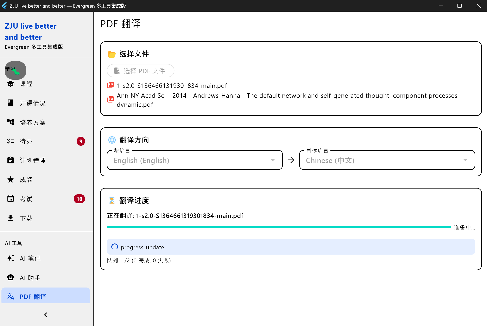

# PR_history/2026-06-19-添加PDF翻译功能.md

## 修改目的

将 PDFMathTranslate-next 的 DeepSeek API PDF 翻译能力集成到 Evergreen Multi-Tools，通过 Python 子进程调用 pdf2zh 引擎，输出保留排版、公式、图表的双语对照 PDF。同时引入应用内反馈系统和一系列 UX 改进。

## 修改文件清单

### 新建文件
- `scripts/pdf_translate.py` — Python 翻译子进程脚本（JSON 事件流、中文 stage 映射、依赖检查）
- `scripts/pdf2zh_next/` — pdf2zh 引擎源码（从 .reference 精简复制：仅保留 config/ translator/ high_level.py 等核心）
- `scripts/python/` — 嵌入式 Python 3.11.9 运行时（不入 git，构建时下载）
- `lib/core/services/pdf_translate_service.dart` — Dart 翻译服务（子进程调用、JSON 解析、Python 自动检测）
- `lib/features/translate/models/translation_enums.dart` — 状态枚举 + 语言选项
- `lib/features/translate/models/translation_job.dart` — 翻译任务/PdfTranslateResult/BatchProgress/TranslateStage
- `lib/features/translate/models/translation_history.dart` — 历史记录（toJson/fromJson）
- `lib/features/translate/providers/translate_provider.dart` — Riverpod 状态管理（不可变 state + copyWith）
- `lib/features/translate/screens/translate_screen.dart` — 主界面（选文件、语言、阶段管线、进度、结果、历史、全屏阅读）
- `lib/features/translate/widgets/pdf_preview_widget.dart` — PDF 内嵌预览（pdfrx，可翻页）
- `lib/features/translate/widgets/translation_history_card.dart` — 历史记录卡片
- `test/features/translate/models/translation_models_test.dart` — 模型测试
- `test/features/translate/providers/translate_provider_test.dart` — 历史和状态测试
- `test/features/translate/services/pdf_translate_service_test.dart` — 服务测试
- `lib/core/feedback/feedback_bar.dart` — 固定底栏（路由 + 时钟 + 反馈按钮，仅 debug）
- `lib/core/feedback/feedback_dialog.dart` — 输入弹窗（标签选择 + 描述 + 提交）
- `lib/core/feedback/feedback_writer.dart` — Markdown 写入器（微秒时间戳）
- `lib/core/feedback/screenshot.dart` — 全屏截图工具
- `agent_contributing/experiences/2026-06-19-pdf-translate-python-subprocess.md` — 经验卡片
- `agent_contributing/experiences/2026-06-20-pdf-translate-embedded-python.md` — 经验卡片

### 修改文件
- `lib/core/utils/python_env.dart` — 新增 `resolvePythonExe()` 自动发现、`checkPdf2zhDeps()`、`installPdf2zhDeps()`、`ensurePdf2zhReady()`
- `lib/core/errors.dart` — 新增 `TranslationError` 类、`AppError.translationFailed()`、`AppError.validationError()`
- `lib/core/config/app_config.dart` — 新增 `TRANSLATE_LANG_OUT`、`TRANSLATE_LANG_IN`、`PYTHON_EXE`（五处同步）
- `lib/core/config/app_config_model.dart` — 新增 `pythonExe` 字段
- `lib/core/config/app_config_notifier.dart` — 新增 `PYTHON_EXE` 五处同步
- `lib/core/storage/settings_service.dart` — keys 新增翻译配置
- `lib/core/connectivity/connection_manager.dart` — 新增 `'PDF Translate'` 连接检查
- `lib/main.dart` — 新增 `_healLegacyPrefs()`；新增 `_FeedbackPlugin`
- `.gitignore` — 新增 `test/feedback/`、`scripts/python/`
- `lib/app.dart` — 新增 `/translate` 路由
- `lib/widgets/sidebar.dart` — Collapsed/Expanded/MobileDrawer/MobileTitle 四处加 `'PDF 翻译'`
- `lib/features/settings/screens/settings_screen.dart` — 新增 "PDF 翻译" 设置区（Python 路径 + 语言）
- `scripts/installer.iss` — 打包 Python 运行时 + pdf2zh_next 源码
- `BUILD.md` — 新增嵌入 Python 构建说明

## 核心逻辑说明

### 架构概览
```
用户选择 PDF → Dart UI (TranslateScreen)
  → TranslateNotifier (Riverpod, 不可变 state + copyWith)
    → PdfTranslateService.translate()
      → resolvePythonExe() 自动发现 Python（自带 > 配置 > 系统）
        → Process.start(python, ['scripts/pdf_translate.py', ...])
          → pdf2zh 引擎 (scripts/pdf2zh_next/)
            → DeepSeek API (chat/completions)
              → BabelDOC 排版保留
                → 输出双语 PDF
```

### Python 自动发现（优先级从高到低）
1. `scripts/python/python.exe`（安装包自带，用户无需安装 Python）
2. 用户手动配置的 `PYTHON_EXE`
3. 系统 PATH：`python3` → `python` → `py`

### Python 子进程（scripts/pdf_translate.py）
- **协议**：命令行参数 → JSON 事件流 stdout
- **Stage 映射**：12 个 babeldoc stage 名 → 中文（如 `stage_translate` → "正在调用 AI 翻译..."）
- **事件类型**：`progress`、`stage`、`finish`、`error`

### 批量翻译
- BatchState 管理文件队列，逐文件翻译
- `currentFilePage/Total/Message` 实时更新当前进度
- `overallProgress` 反映全部文件完成比例
- 完成一个即展示"阅读"按钮，可边翻边读

### 应用内 PDF 阅读
- pdfrx 渲染，支持翻页
- 点击内嵌预览 → 全屏阅读
- "阅读双语 PDF"按钮 → 独立全屏路由

### 反馈系统（lib/core/feedback/）
- `kDebugMode` 自动开关——debug 可见，release 剔除
- 时钟同步：`DateTime.now().microsecondsSinceEpoch` 同时写日志+截图+Markdown
- 输出到 `test/feedback/`（gitignore 排除）

## 架构决策记录

1. **嵌入式 Python 方案**：安装包自带 Python 3.11.9，用户零配置
2. **自动发现降级链**：自带 Python → 用户配置 → 系统 PATH
3. **不可变状态模型**：`TranslationJob` + `BatchState` 均不可变 + `copyWith()`，确保 Riverpod 正确通知 UI 重建
4. **Stage 映射在 Python 侧**：翻译脚本负责翻译，Dart 侧只消费
5. **JSON 事件流而非轮询**：子进程 stdout 逐行 JSON，Dart 侧实时解析
6. **Android 标记 (开发中)**：Python 子进程无法在移动端运行
7. **反馈模块插件化**：`kDebugMode` 自动开关

## 已修复的问题

1. **硬编码 `'python'` 导致翻译失败** — 改为安装包自带 Python + 自动检测
2. **进度不刷新 (Riverpod 陷阱)** — `TranslationJob` 可变 + `state = job..field = x` 同一引用不触发重建 → 改为不可变 `copyWith()`
3. **Stage 名显示为技术术语** — pdf_translate.py 12 个 stage 映射为中文
4. **缺少阶段管线** — TranslateStage 枚举 + 9 图标管线 UI
5. **批量进度卡死** — BatchState 新增 currentFilePage/Total/Message，实时更新
6. **无应用内阅读** — 全屏 PDF 阅读路由 + 点击预览进入
7. **Dart 运算符优先级陷阱** — `??` vs `?:` 显式加括号
8. **配置系统五层不同步** — `SettingsService._keys`、`AppConfigData`、`AppConfigNotifier` 补齐
9. **SharedPreferences 类型残留** — `_healLegacyPrefs()` 启动修复
10. **pdf2zh 源码冗余** — 删除 GUI/CLI/assets
11. **tomlkit 依赖遗漏** — pip install 补全 babeldoc/pymupdf/openai/tomlkit
12. **Dart 记录类型语法** — `(a,b,c)` 只能用 `$1/$2/$3` 不能用 `.property`
13. **const 构造函数 + DateTime.now()** — 去掉 const

## 测试结果摘要

- 新增测试：`flutter test test/features/translate/` ✅ 28/28 通过
- 全量测试：`flutter test` — 1006 passed, ~1 skipped, 1 failed（已有问题）
- Dart 静态分析：✅ 所有修改文件零诊断错误
- 嵌入式 Python 导入验证：✅ pdf2zh_next, babeldoc, pymupdf, openai 全部通过

## 人工验证清单（由人类执行）

- [x] `flutter build windows --release` 编译成功
- [x] 单文件翻译：进度条实时更新、阶段管线图标正确展示
- [x] 翻译完成后点击预览 → 全屏阅读
- [x] 侧边栏出现 "PDF 翻译" 入口
- [x] 已有关键流程（登录、课表、AI 对话）未受影响
- [x] 补充测试截图至本文件

