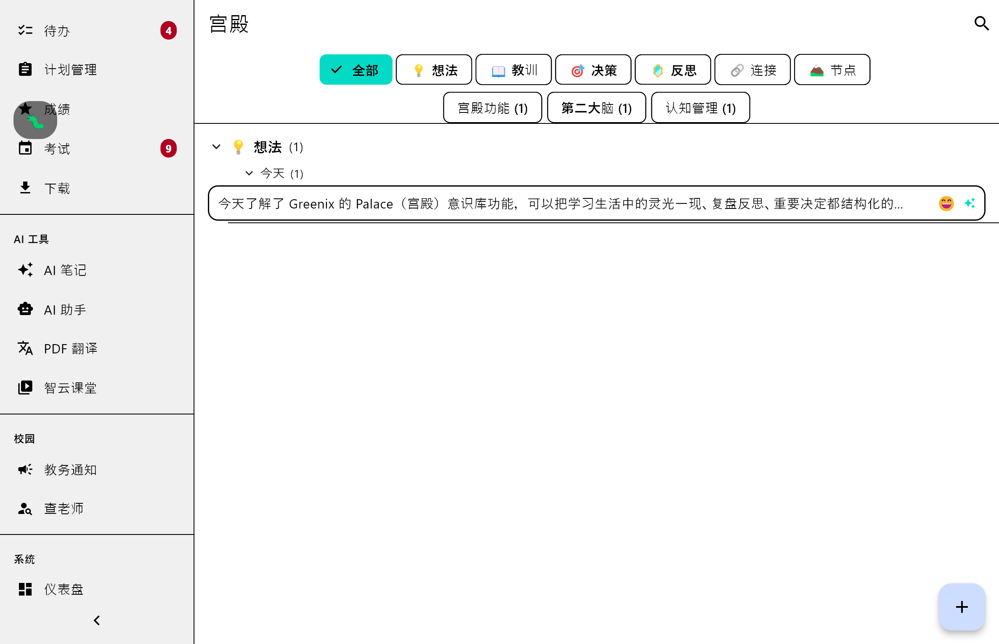

# Palace Core Phase 1 — 个人世界宫殿认知中间件

## 修改目的

在 Evergreen 已有的 Agent 运行时和记忆系统之上，新增 Palace Core 认知中间件。打通"AI 对话 → 指挥 AI 写入 → 结构化存储 → 树状浏览"的完整闭环。

## 修改文件清单

### 新增文件（28 个）

**Core 层 — `lib/core/palace/`**
- `palace.dart` — 库入口
- `models/consciousness_event.dart` — 意识事件模型 + YAML 序列化
- `models/context_snapshot.dart` — 情境快照模型
- `models/structured_lesson.dart` — 结构化教训 + ApplicabilityCondition + CounterExample + LessonRevision
- `models/echo_schedule.dart` — 回响调度骨架（Phase 2 用）
- `storage/palace_paths.dart` — `.greenix/palace/` 路径管理
- `storage/event_store.dart` — EventStore（CRUD + 三重索引）
- `capture/context_capturer.dart` — 情境自动采集器
- `capture/quick_capture_service.dart` — 捕捉管线编排（写入→AI补全→教训→追问）
- `refinery/lesson_extractor.dart` — AI 教训提取
- `refinery/question_generator.dart` — 苏格拉底追问生成
- `refinery/auto_tagger.dart` — 自动标签建议
- `tools/capture_to_palace_tool.dart` — Agent 工具（用户用自然语言指挥 AI 写入 Palace）

**Feature 层 — `lib/features/palace/`**
- `palace_feature.dart` — Feature 库入口
- `providers/palace_event_store_provider.dart` — EventStore 单例 Provider
- `providers/palace_filter_provider.dart` — 过滤条件 Provider
- `providers/palace_events_provider.dart` — 事件列表 Provider
- `providers/palace_capture_provider.dart` — 捕捉浮窗状态 Provider
- `providers/palace_lessons_provider.dart` — 教训列表 Provider
- `providers/palace_tags_provider.dart` — 标签云 Provider
- `screens/palace_screen.dart` — 主页面（树状视图 + 搜索 + 捕捉入口）
- `dialogs/capture_dialog.dart` — 快速捕捉弹窗
- `widgets/emotion_selector.dart` — 情绪选择器
- `widgets/tag_chip_bar.dart` — 标签 Chip 栏
- `widgets/type_filter_bar.dart` — 六类型过滤 Tab
- `widgets/event_card.dart` — 事件卡片
- `widgets/event_detail_panel.dart` — 事件详情面板
- `widgets/event_tree_view.dart` — 三层树状视图（类型→日期→卡片）

**测试文件**
- `test/core/palace/models/consciousness_event_test.dart` — 模型序列化（8 tests）
- `test/core/palace/models/structured_lesson_test.dart` — 教训模型（6 tests）
- `test/core/palace/storage/event_store_test.dart` — EventStore CRUD + 索引（14 tests）
- `test/core/palace/capture/context_capturer_test.dart` — 情境采集（4 tests）
- `test/core/palace/refinery/lesson_extractor_test.dart` — 教训提取 JSON 解析（4 tests）
- `test/features/palace/widgets/event_card_test.dart` — 卡片渲染（4 tests）
- `test/features/palace/widgets/event_tree_view_test.dart` — 树视图交互（5 tests）

### 修改已有文件（5 个）

| 文件 | 改动 |
|------|------|
| `.gitignore` | +1 行：`.greenix/palace/` |
| `lib/app.dart` | +2 行：import + `/palace` 路由（fade transition） |
| `lib/widgets/sidebar.dart` | +7 行：4 处导航项追加（收起侧栏/展开侧栏/移动端抽屉/移动端标题） |
| `lib/features/agent/providers/agent_provider.dart` | +10 行：Palace 导入 + QuickCaptureService 构造 + CaptureToPalaceTool 注册 |
| `lib/core/config/app_config_notifier.dart` | +6 行：`@visibleForTesting envFilePathOverride` + import + 分支逻辑 |
| `test/core/config/app_config_notifier_test.dart` | 重写：临时 `.env` 文件隔离，修复 SharedPreferences 泄漏 |

## 核心逻辑说明

### 数据流
```
用户触发 → Agent 工具(capture_to_palace) 或 捕捉弹窗(CaptureDialog)
  → QuickCaptureService.capture()
    → ① 创建 ConsciousnessEvent
    → ② DeepSeekProvider → AI 摘要
    → ③ AutoTagger → 标签建议
    → ④ EventStore.save() → 文件落盘(.greenix/palace/events/{YYYY}/{MM}/{uuid}.md)
    → ⑤ 三重索引重建(EVENTS_BY_DATE/TYPE/TAG.md)
    → ⑥ LessonExtractor → 教训草稿(version=0)
    → ⑦ QuestionGenerator → 3 个追问
  → 返回 CaptureResult → UI 展示结果
```

### 存储
- `.greenix/palace/events/{YYYY}/{MM}/{uuid}.md` — 独立 YAML frontmatter schema
- 三个索引文件在 events 目录下：`EVENTS_BY_DATE.md` / `EVENTS_BY_TYPE.md` / `EVENTS_BY_TAG.md`
- 读操作纯内存索引（启动时加载三个索引到 `Map<String, _EventIndexEntry>`），不扫描文件

### Agent 集成
- `CaptureToPalaceTool` 注册到 Agent 的 `Registry`（`agent_provider.dart:registerAll` 末尾）
- 共享 Agent 已有的 `DeepSeekProvider` 实例（不重复创建）
- 工具名为 `capture_to_palace`，rank 为 write（串行执行）

## 潜在影响

- **零影响**：Agent 运行时核心循环、已有 Feature、已有路由、已有侧边栏项全部零修改
- **Agent 对话**：新增 `capture_to_palace` 工具，不影响已有工具
- **启动性能**：`agent_provider.dart` 初始化时创建 `EventStore` + `QuickCaptureService`，增加 ~50ms（可接受）
- **磁盘**：Palace 数据写入 `.greenix/palace/`，与已有 `.greenix/memories/` 物理隔离
- **API 成本**：每次捕捉触发 3 次 DeepSeek 调用（摘要 + 教训提取 + 追问），但均为按需触发

## 测试结果摘要

- 新增测试：`flutter test test/core/palace/ test/features/palace/` → **42/42 ✅**
- 全量测试：`flutter test` → **1067/1067 ✅**（0 failures, 1 skipped）
- `flutter analyze` → pre-existing warnings only, no Palace errors
- 编译验证：`flutter build windows` — 待人工补充

---

## Phase 1 修复（2026-06-23 第二轮—Bug 修复）

### 修复原因
Phase 1 完成后发现有多个 Bug 导致 Palace 无法正常工作：
1. `agentRuntimeProvider` 和 `palaceEventStoreProvider` 各自创建了独立的 EventStore → Agent 工具写入的事件不会出现在 UI
2. 日期索引的 `📌` emoji 导致 `DateTime.tryParse` 失败 → 今天的所有事件在索引中丢失
3. 索引文件损坏时没有回退机制 → 已有事件永久丢失
4. `all()` 方法空断言在文件损坏时崩溃

### 修复文件清单

| 文件 | 改动 | 行数 |
|------|------|------|
| `lib/features/agent/providers/agent_provider.dart` | -1 行: 移除 `import '../../../core/palace/storage/event_store.dart';`<br>+1 行: 新增 `import '../../palace/providers/palace_event_store_provider.dart';`<br>-1 行: `EventStore(palaceEventsDir)` → `ref.read(palaceEventStoreProvider)` | 净 ~2 行 |
| `lib/core/palace/storage/event_store.dart` | +35 行: 新增 `_scanEventsDir()` 文件系统扫描回退<br>~10 行: 重构 `_loadIndexes()` 增加回退逻辑<br>修复 📌 emoji 解析<br>修复 `all()` 空断言 → `whereType<>()`<br>清理 `_loadTagIndexes` 中无用的 `.split(']')` | 净 ~45 行 |
| `lib/features/palace/providers/palace_capture_provider.dart` | +2 行: `_captureService` getter 改为懒缓存（`??=`） | 净 +2 行 |

### 核心修复逻辑

**修复 1 — 共享 EventStore**：`agentRuntimeProvider` 不再自己 `new EventStore()`，改为 `ref.read(palaceEventStoreProvider)`。全应用只有一份 EventStore 实例，Agent 工具和 Palace UI 共享同一份内存索引。

**修复 2 — emoji 解析**：`_loadIndexes` 解析日期字段前调用 `.replaceAll(RegExp(r'[📌]'), '')` 剥离标记。

**修复 3 — 文件系统扫描回退**：新增 `_scanEventsDir()`，递归扫描 `_eventsDir` 下所有 `.md` 文件（跳过 `EVENTS_BY_*`），逐文件解析 YAML frontmatter 重建 `_index`。在索引缺失/损坏时自动调用。

**修复 4 — 空断言安全化**：`all()` 从 `ids.map((id) => get(id)!).toList()` 改为 `ids.map((id) => get(id)).whereType<ConsciousnessEvent>().toList()`。

**修复 5 — 缓存复用**：`_captureService` 从每次 new 改为 `_cachedCaptureService ??=` 懒初始化。

### 修复后测试
- Palace 测试：`flutter test test/core/palace/ test/features/palace/` → **42/42 ✅**
- 扩展测试（palace + agent + config）：157/157 ✅

## 人工验证清单（由人类执行）

- [x] 编译成功：`flutter build windows --release`
- [x] 启动 App → 侧栏可见「宫殿」入口
- [x] 点击「宫殿」→ 进入 Palace 主页面（树状视图，默认显示"宫殿空空如也"）
- [x] 点击 FAB → 弹出捕捉弹窗 → 填写内容 + 选择类型 + 情绪 → 点击「存入宫殿」
- [x] 存入后 → 事件出现在树状视图中 → 点击展开详情
- [x] 进入 AI 助手 → 输入"帮我把xxx记到宫殿" → AI 调用 capture_to_palace 工具
- [x] 已有核心流程（登录、课表、成绩、AI 对话）未受影响
- [x] 补充测试截图至本文件


