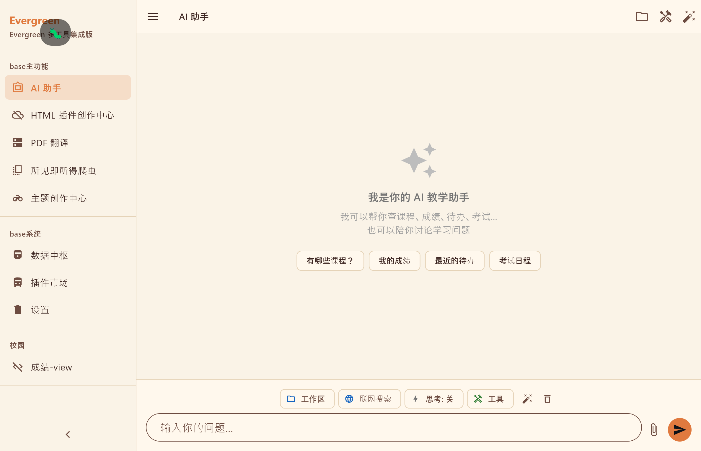
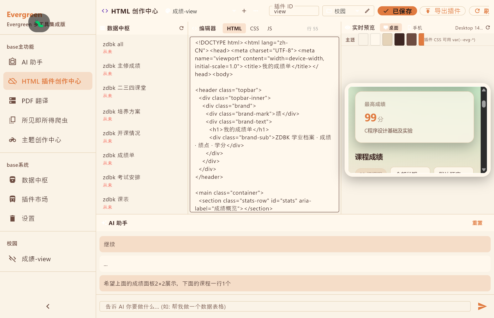
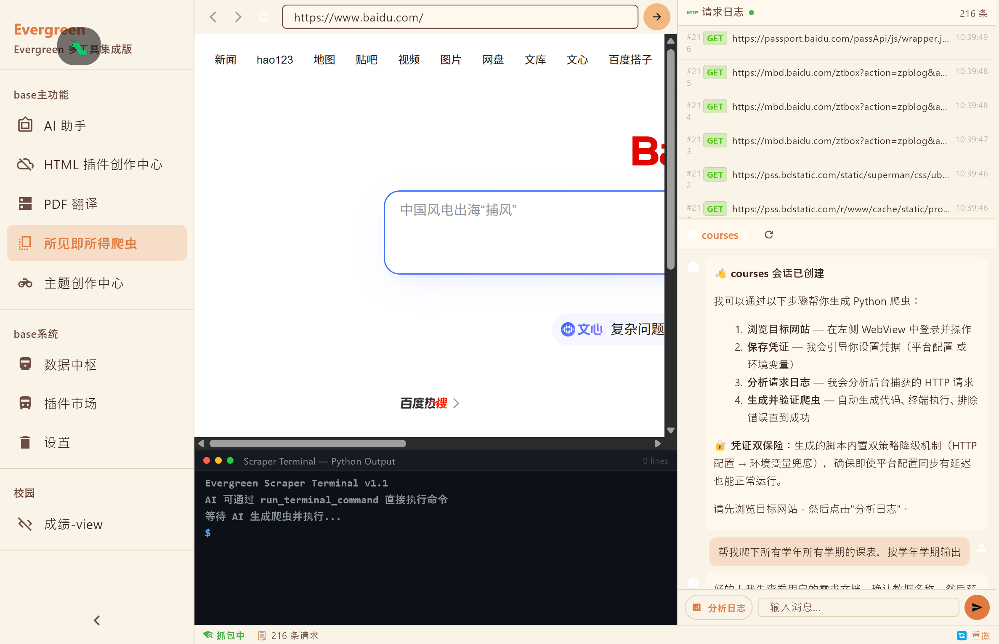
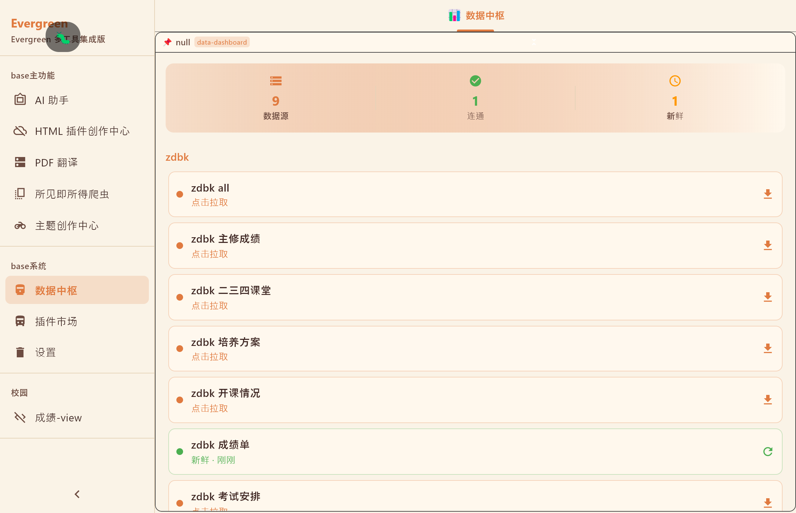
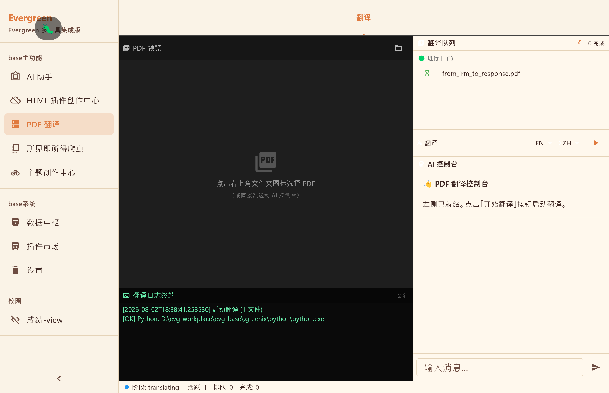
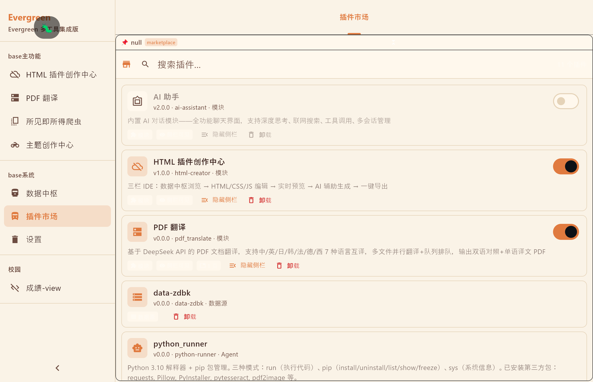
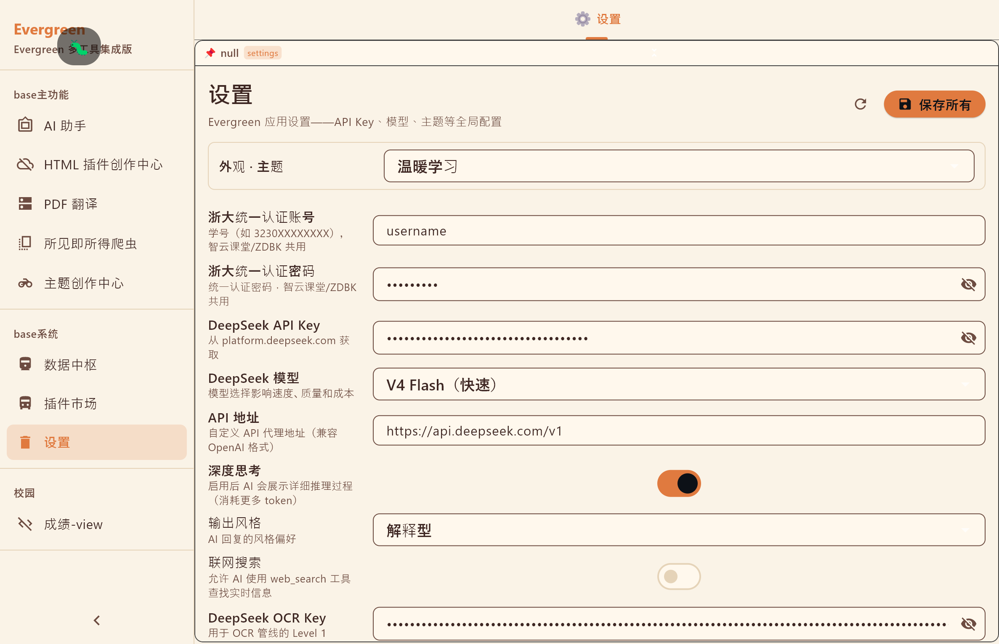
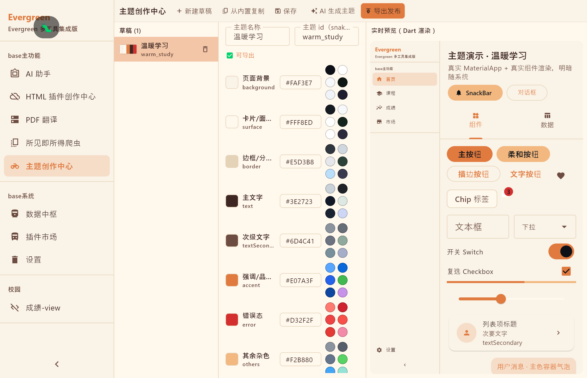

# Evergreen 2.0-alpha

Evergreen 2.0-alpha，即 Evergreen 2.0 预览版，正式发布。

## 背景

随着 AI 技术的快速发展，各种 AI+ 产品如潮水般涌出，但在 AI4Life 方面似乎仍有所欠缺。

类比 AI4Science、AI4Education 等方向，我们指出 AI4Life 的核心难点在于自由度：每个人都有自己的一套生活习惯与规律，而 AI 技术能提供的自由度却很有限。现有的绝大多数 AI 工具——AI 陪伴聊天、AI 知识库管理、AI 辅助刷题等——都依赖硬编码出功能强大的 AI 能力；这些功能或许足够强大，却无法满足用户的个性化需求。
近期，腾讯 workbuddy、字节豆包 AI 工作台等 AI 创作工具蓬勃发展。这些工具普遍依赖强大的 loop engineering（循环工程）实现端到端的工作台创作，极大地提升了 AI 功能的自由度，满足了不少用户的个性化需求，但同时也遗留了不少问题。
1. 现有 AI 工具可能还不足以快速、精确地帮助用户搭建复杂的工作台，尤其是对弱编程基础的人群而言，仍存在以下显著问题：
(1) 难以实现完整的 AI 驱动的目标 App。以腾讯 workbuddy 为例，其 Web App、移动端 App 等任务模式集中分布于设计创意模块，skill 主要聚焦于前端设计，部分提示语过度强调前端的必要性，而几乎未对后端搭建给出有效的指导性建议；
(2) 难以实现外部数据驱动的目标 App。爬虫构建严重依赖真实的浏览器访问日志，然而对弱编程用户而言，根据实际需求提供所需的 Cookie 等信息存在一定门槛，AI 调适成本高、准确率低；
(3) 难以实现复杂的多插件集成式 App。用户创建的每个实例都是独立的实体，在不同实例间切换会降低各插件之间的耦合度。对日常生活而言，我们或许需要覆盖不同方面的多个实例，以更好地实现 AI4Life——而现有实现在这方面无疑存在明显欠缺。

AI 创作平台并非新事物。近年来，网易星匣、每日问答个知 AI、红果短视频等平台也陆续在市场上有所表现，但侧重点各不相同：星匣旨在创建 AI 游戏生态；红果短视频专注于维护 AI 短剧创作生态；每日问答则聚焦私有化 AI 部署。这些平台的实现要么过重——不同实例跳转不够流畅自然，每个实例都需要单独实现许多复杂功能；要么过轻——缺乏对 AI 创作与用户创作的支持。

Evergreen 本意是"绿意不息"。这个英文译名或许因为过于常见而略显不妥，但作为一个全开源、非商业的项目，我们目前并不打算深究译名问题。我们的初衷是尽可能满足用户的个性化需求——将 Evergreen 定位为一个面向 AI4Life 的 AI 平台，并希望把它建设成每个普通个体都能参与共创的优良 AI 生态。

在 1.x 版本中，我们通过硬编码各类插件模块的方式，针对浙大场景做了一些优化，并制定了较为详尽的 AI 贡献协议，包括但不限于贡献的 SKILL、经验库架构，以及尚不稳定的多 Agent 协同创作机制。我们尽可能解耦各个模块，利用模块注册与自发现等机制，最小化每个人添加新模块的参与成本，力求覆盖每个人日常生活中的习惯与需求。

但我们很快发现，这会带来一个严重的问题：应用越做越大，出现了许多并非必需的功能，而真正满足个性化需求的模板，反而可能因隐私等诸多问题未能公开。此外，多个分别提出不同模板的 PR 会给合并带来挑战；对 Flutter 编译环境的强依赖，也使提交 PR 或本地快速新建新模块，成为弱编程群体参与创作的障碍。

v2.0-alpha 作为 Evergreen 2.0 的预览版，我们近乎重写了整个 App。针对 v1.x 的诸多问题，我们经历了渲染层 v1 到 v6 的多次重构：v1~v5 试图搭建一套完整的 Dart 组件，实现单 JSON 驱动的渲染机制；v6 则在 v5 渲染层的基础上进一步抽象，将渲染层重构为混合实例架构，并把 v4/v5 的通用组件打包成 v4-modle。每个实例 modle 维护自己的 JSON 协议，同时我们新增了 HTML 路径，让插件创作仅局限于 HTML 创作。这一技术取舍，使我们既拥有豆包工作台 Web App 那样的创作能力，又保留了 v1.x 那种通过注册新 modle 实现 Dart 原生渲染的特性，极大增强了 App 的自由度。我们的 core 代码通过 HTTP 对外公开 API，虽然预览版尚未很好地实现这条 HTML 后端搭建的快捷路径；但无疑，这种架构已经注定了这只是时间问题。

---

## 内置插件资产

> 2.0-alpha 预览版已集成 **12 个模块插件** + **15 个内置 Agent 工具**，覆盖 AI 对话、数据采集、学术研读、效率工具、创作定制全场景。

### AI 工具

| 插件 | 能力 |
|------|------|
| **AI 助手** `ai-assistant` | 全功能聊天界面：多级深度思考、联网搜索（Bing）、工具调用、多会话管理 |
| **Python 运行器** `python-runner` | Agent 可调用的本地 Python 3.10 环境：执行任意代码、pip 包管理、系统诊断 |
| **HTML 创作中心** `html-creator` | 三栏 IDE：数据中枢浏览 → HTML/CSS/JS 编辑 → 实时预览 → AI 辅助生成 → 一键导出 |

### 数据与采集

| 插件 | 能力 |
|------|------|
| **所见即所得爬虫** `scraper` | 内嵌浏览器抓包 → AI 自动生成 Python 爬虫 → 导出 `.py` / `.exe` |
| **数据中枢** `data-dashboard` | 数据源状态总览：连通性检测、新鲜度检查、一键拉取（浙大教务/智云课堂数据为内置 Dart fetcher，见「浙大针对性改造」） |

### 效率工具

| 插件 | 能力 |
|------|------|
| **PDF 翻译** `pdf_translate` | DeepSeek API 驱动，中/英/日/韩/法/德/西 7 语言互译，双语对照 PDF 输出，多文件并行翻译 |
| **插件市场** `marketplace` | 插件全生命周期管理：浏览、搜索、安装、启用/停用、卸载 |
| **设置面板** `settings` | API Key、模型、主题等全局配置，附带 HTTP 设置页面 |
| **成绩 View** `view` | HTML 模板渲染的成绩查看器 |

### 创作定制

| 插件 | 能力 |
|------|------|
| **主题创作中心** `theme-creator` | 8 色语义色板可视化编辑 + Dart 实时预览 + AI 生成 + 一键导出主题插件 |
| **温馨学习** `warm_study` | 暖色调主题（#FAF3E7 背景 + 8 色语义色板） |

### Agent 工具体系

AI Agent 可调用 **15 个内置工具**，均通过 `function calling` 自动调度：

| 类别 | 工具 | 权限 |
|------|------|------|
| 文件操作 | `read_file` `write_file` `read_head` `read_tail` `file_info` `grep` | 写操作需确认 |
| 记忆管理 | `read_global_memory` `write_global_memory` | 写操作需确认 |
| 网络 | `web_search`（Bing 零 API Key） `web_fetch` | 只读 |
| 数据 | `data_query` `get_user_info` | 只读 |
| 技能 | `list_skills` `run_skill` | 只读 |
| 执行 | `python_runner`（本地 Python 解释器） | 需确认 |

### 截图一览

<table>
<tr>
<td align="center" width="50%"><b>AI 助手</b><br></td>
<td align="center" width="50%"><b>HTML 创作中心</b><br></td>
</tr>
<tr>
<td align="center" width="50%"><b>爬虫生成器</b><br></td>
<td align="center" width="50%"><b>数据中枢</b><br></td>
</tr>
<tr>
<td align="center" width="50%"><b>PDF 翻译</b><br></td>
<td align="center" width="50%"><b>插件市场</b><br></td>
</tr>
<tr>
<td align="center" width="50%"><b>设置面板</b><br></td>
<td align="center" width="50%"><b>主题创作中心</b><br></td>
</tr>
</table>

---

## 架构特性

- **双轨架构** — `PluginBridge`（Agent Tool 调 Python 插件）+ `ModuleLoader`（Flutter 模块插件），两种扩展方式解耦
- **声明式模块** — `ModuleDescriptor` JSON 注册 → `TemplateRegistry` 分派路由，未知字段静默忽略
- **多模板共存** — v4（通用 composite）、paper_reading（论文三栏）、html（内嵌渲染）、scraper（爬虫生成）、theme_creator（主题编辑）、zju（浙大校园）等 7 套模板
- **全流程插件系统** — 插件定义 → 打包 → 插件市场安装/卸载，完整闭环
- **本地优先** — 数据走 `.greenix/` 工作区文件系统 + SharedPreferences，零服务端依赖
- **三层架构** — `core/`（纯 Dart 服务层）→ `plugins/`（JSON 声明 + .exe）→ `renderer/`（纯 UI 渲染层），严格分层禁止跨层耦合
- **CI/CD 就绪** — `Test` 工作流（push/PR 快速验证）+ `Release` 工作流（tag v* 触发或手动构建发布）

---

## 浙大针对性改造（v2.0）

v2.0 将浙大校园功能从「外部插件」收敛为「内置模块 + 内置数据源」，并引入双版构建机制，让通用用户不再背负浙大专属代码体积。

### 双版构建：浙大专用版 / 通用版

同一仓库、构建期选择性装入，产物区分：

| 版本 | profile | 模板路由 | 产物 |
|------|---------|----------|------|
| **浙大专用版**（zju） | `release_full` | 全部 8 套，含 zju / classroom / zdbk | `EvergreenSetup-Zju-*.exe` / `evergreen-zju-*` |
| **通用版**（std） | `release_std` | 5 套，浙大路由回退 v4 | `EvergreenSetup-Std-*.exe` / `evergreen-std-*` |

双通道控制（缺一不可）：

- **模板路由**：`templates_index.json` 模板清单 + `build_profiles/<profile>.json` → `tool/gen_template_registry.dart --profile` 生成 `generated/template_registry.g.dart`，未选中模板被 AOT tree-shaker 剔除出产物
- **运行注册**：`app_bootstrap.dart` 编译期常量 `kZjuEnabled`（`--dart-define=EVERGREEN_ZJU=false`）控制浙大数据源/内置模块注册，通用版调用不可达、浙大依赖整体剔除

每个版本同时发布 **debug / release** 两套（Release 共 8 个附件）：release 为 AOT + tree-shake 的日常版本；debug 保留完整日志（logcat/stderr），用于调试与复现问题。

### 教务数据源内置化

删除 `data-zdbk` 外部插件（scraper.py + manifest + config），教务数据改为内置 Dart fetcher（`zju_modle/zju_data_sources.dart`）注册进数据中枢，9+ 个 DataType（`zju_courses` / `zju_scores` / `zju_exams` / `zdbk_*` …）：

```
renderer UI → resolveDataSource(orch://zju_*) → DataOrchestrator → Dart fetcher
```

缓存 / 状态 / 刷新 / 连通性由数据中枢统一管理；凭证迁移至设置面板（`ZJU_USERNAME` / `ZJU_PASSWORD`，教务、智云课堂、图书馆、一卡通共用）。

### 内置校园模块（9 个）

`zju_builtin_modules.dart` 注册 9 个内置模块，`template: 'zju'` → `ZjuModleView` 按 `modleRoute` 分派，侧边栏分组：

| 分组 | 模块 | 说明 |
|------|------|------|
| 浙大·学习 | 我的课程 `courses` | 课程列表 + 周课表（SSO 直连教务） |
| | 我的成绩 `scores` | 成绩查询 + GPA 仪表盘（fl_chart） |
| | 考试安排 `exams` | 考试日程 |
| 浙大·校园 | 教务中心 `zdbk` | 开课情况 / 培养方案 / 教务通知（TabBar 三页） |
| | 智云课堂 `classroom` | 录播回看：课程列表 → 视频 + PPT 同步 + 带时间戳字幕 |
| | 图书馆 `library` | 借阅（建设中） |
| | 一卡通 `ecard` | 消费流水（建设中） |
| | 查老师 `teachers` | 教师评价（内置 chalaoshi 数据集，离线可用） |
| | 课表 `schedule` | iCal 导出（建设中） |

### 统一认证（SSO）

`zju_modle/zju_auth/` 自研统一认证层：登录拦截 → 认证服务 → 会话持久化（`cookie_jar` + `dio_cookie_manager` 跨重启保活），业务模块共享同一登录态；cookie 落盘 `.greenix/.cookies` 与 `.greenix/zju_cookies.json`。

### 其他

- **智云课堂播放链路**：video_player_panel / ppt_viewer / subtitle_timeline 重构，PPT 文本 + 带时间戳字幕聚合为 AI 可读内容
- **media_kit 防复发**：`windows/CMakeLists.txt` 校验 libmpv/ANGLE 产物完整后强制 `MEDIA_KIT_LIBS_AVAILABLE=ON`（bug-0002）
- **新增依赖**：`cookie_jar` / `dio_cookie_manager`（SSO）、`fl_chart`（GPA 仪表盘）

---

## 快速开始

```bash
git clone https://github.com/lybx-leyw/evergreen-main.git
cd evg-base
flutter pub get
flutter run -d windows   # 或 -d android
```

首次使用请在 Settings 中填入 `DEEPSEEK_API_KEY`（DeepSeek 开放平台免费注册）。

---

## 项目结构

```
evergreen-main/
├── .github/workflows/          GitHub Actions（test.yml + release.yml）
├── evg-base/
│   ├── lib/
│   │   ├── main.dart           启动入口
│   │   ├── app.dart            MaterialApp.router
│   │   │
│   │   ├── core/               纯 Dart 服务层（6 个 HttpServer）
│   │   │   ├── agent/          Agent Runtime — function calling / 工具注册 / 会话管理
│   │   │   ├── config/         配置读写封装（SharedPreferences / HttpServer）
│   │   │   ├── data/           数据管道 — orchestrator / manifest / 插件热注册
│   │   │   ├── module/         ModuleDescriptor / ModuleLoader / ProcessManager
│   │   │   ├── theme/          ThemeDescriptor / ThemeLoader / ThemeStore
│   │   │   ├── services/       通用服务（OCR 管线 / PDF 翻译 / 插件安装器 / 更新）
│   │   │   ├── utils/          工具函数（文件 / 路径 / Python 环境 / token 估算）
│   │   │   ├── plugin/         插件运行器
│   │   │   └── feedback/       用户反馈收集
│   │   │
│   │   ├── renderer/           纯 UI 渲染层
│   │   │   ├── app/            应用壳（AppShell / CommandPalette / DebugErrorBar）
│   │   │   ├── atomic/         共享原子取数原语（data_source_resolver / json_path）
│   │   │   ├── components/     共享组件（MarkdownRenderer / ChatView / 图表 / 代码高亮）
│   │   │   ├── module/         模块调度（ModuleDispatch / ModulePage）
│   │   │   ├── multi_agent/    多 Agent 协作视图
│   │   │   ├── page/           页面视图（市场 / 设置 / 数据看板 / 文件查看器 / 全局记忆）
│   │   │   └── templates/      模块模板（v4 / zju（含 zdbk、classroom 别名）/ paper_reading / html / scraper / theme_creator）
│   │   │
│   │   └── theme/              根级兼容性 stub
│   │
│   ├── plugins/                插件仓库（12 个内置插件）
│   │   ├── ai-assistant/       AI 助手
│   │   ├── data-dashboard/     数据看板
│   │   ├── html-creator/       HTML 创作中心
│   │   ├── marketplace/        插件市场
│   │   ├── pdf_translate/      PDF 翻译
│   │   ├── python-runner/      Python 运行器
│   │   ├── scraper/            爬虫生成器
│   │   ├── settings/           设置面板
│   │   ├── theme-creator/      主题创建器
│   │   ├── view/               成绩 View
│   │   └── warm_study/         温馨学习主题
│   ├── scripts/                Python 管线脚本
│   │   ├── paper_reader.py     PDF 提取 + pdf2zh_next 翻译
│   │   ├── paper_vision.py     OCR + 章节拆分 + 段落重排 + 翻译
│   │   ├── pdf_translate.py    PDF 翻译管线
│   │   ├── pdf_to_images.py    PDF 转图片
│   │   ├── ocr_file.py         文件 OCR
│   │   └── ocr_slides.py       幻灯片 OCR
│   │
│   ├── assets/                 资产（plugins_bundle / video）
│   ├── android/                Android 平台（Chaquopy Python 3.11）
│   ├── windows/                Windows 平台（CMake / Win32）
│   └── pubspec.yaml
│
├── PRODUCT_DESIGN_DOCUMENT.md  产品设计文档
├── v5P渲染重构规划.md          v5 渲染重构规划
└── CLAUDE.md                   AI 协作入口
```

---

## 技术栈

**前端**: Flutter 3.x · Dart 3.9 · Riverpod · go_router · Dio · flutter_markdown · flutter_math_fork · flutter_highlight · flutter_mermaid · HtmlWidget · media_kit · xterm · re_editor · pdfx

**后端（本地）**: 6 个自管 HttpServer · JSON Lines 子进程协议

**AI**: DeepSeek API（Chat + FIM）· Bing 搜索引擎

**Python 管线**: pdf2zh_next · pymupdf · Chaquopy（Android 端内嵌 Python 3.11）

---

## 架构

```
┌──────────────────────────────────────────────┐
│  renderer/    纯 UI 渲染层                    │
│  ├─ 模板系统（v4 / paper_reading / ...）       │
│  ├─ 共享组件（Markdown / Chat / 图表）         │
│  └─ 原子取数原语                              │
├──────────────────────────────────────────────┤
│  plugins/     JSON 声明式插件                  │
│  ├─ config.json 定义模块                      │
│  └─ .exe / .dart 可执行体                     │
├──────────────────────────────────────────────┤
│  core/        纯 Dart 服务层（禁止引用 Flutter）│
│  ├─ 6 HttpServer（Agent/Config/Data/...）     │
│  ├─ PluginBridge（Agent Tool ↔ 子进程）       │
│  └─ ModuleLoader（模块热插拔）                │
└──────────────────────────────────────────────┘
```

renderer 通过 Riverpod 从 core 取数据，不直调 HTTP；core 不引用任何 Flutter Widget。

---

## 创建新插件

只需一个 JSON 声明文件即可注册模块：

```jsonc
// plugins/<id>/module/manifest.json
{
  "id": "my-tool",
  "name": "My Tool",
  "version": "1.0.0",
  "template": "v4",
  "description": "...",
  "pages": [
    {
      "id": "main",
      "title": "主页",
      "layout": { "type": "composite", "slots": [...] }
    }
  ]
}
```

Python 脚本通过 `PluginBridge` 注册为 Agent 工具（本地子进程，JSON Lines 协议），或用 PyInstaller 打包为 `.exe` 供插件市场分发。

---

## CI / CD

### Test 工作流（`test.yml`）

`push` 到 `main` 或发起 `pull_request` 时自动触发，5-10 分钟出结果：

| Job | 说明 | 环境 |
|-----|------|------|
| 子包测试 | core 子模块 dart test | ubuntu-latest |
| Flutter 测试 | 根级 flutter test（含 widget 测试） | ubuntu-latest |

### Release 工作流（`release.yml`）

打 `v*` tag 或手动触发（`workflow_dispatch`），构建 **双版 × 双模式** 产物（浙大专用版 / 通用版 × debug / release，共 8 个附件）并创建 GitHub Release：

| Job | 说明 | 环境 |
|-----|------|------|
| 构建 Android APK | 双版 × debug/release 共 4 个 APK（Chaquopy Python 3.11） | ubuntu-latest |
| 构建 Windows | 双版 × debug/release 共 4 个安装包（Inno Setup + 嵌入式 Python） | windows-latest |
| 创建 Release | 自动生成 Release Notes + 8 个附件上传 | ubuntu-latest |

> Alpha/Beta/RC 版本自动标记为 pre-release。
