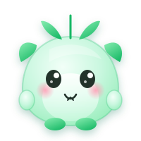

<div align="center" style="background-color:#232326;border:1px solid #3f3f45;border-radius:12px;padding:32px 24px 24px;">


<span style="font-size:32px;font-weight:700;color:#f4f3f1;letter-spacing:2px;">Evergreen</span>

<span style="color:#c9c8c5;font-size:15px;">面向 AI4Life 的开源 AI 平台 · 本地优先 · 插件化 · 跨平台</span>

<br/><br/>


<span style="color:#99999a;font-size:13px;">当前版本 v2.0-rc 系列（最新 tag：`v2.0-rc.6.3`）· 本项目以 **GPLv3** 许可证发布，详见 [LICENSE](./LICENSE)</span>

</div>

---

## ✨ 核心能力

<table align="center" style="background-color:#232326;border:1px solid #3f3f45;border-radius:12px;">
<tr>
<td width="33%" align="center" style="background-color:#2e2e33;border:1px solid #3f3f45;border-radius:8px;padding:16px 12px;">

<span style="font-size:15px;font-weight:600;color:#f4f3f1;">🤖 AI 助手</span>

<span style="color:#99999a;font-size:13px;">本地优先的 Agent 运行时<br/>对话 / 工具 / 记忆 / Skill / 守护</span>

</td>
<td width="33%" align="center" style="background-color:#2e2e33;border:1px solid #3f3f45;border-radius:8px;padding:16px 12px;">

<span style="font-size:15px;font-weight:600;color:#f4f3f1;">🎨 HTML 插件创作</span>

<span style="color:#99999a;font-size:13px;">三栏 IDE · 实时预览<br/>AI 辅助生成 / 改稿 · 一键导出</span>

</td>
<td width="33%" align="center" style="background-color:#2e2e33;border:1px solid #3f3f45;border-radius:8px;padding:16px 12px;">

<span style="font-size:15px;font-weight:600;color:#f4f3f1;">🧩 插件市场</span>

<span style="color:#99999a;font-size:13px;">内置插件仓库<br/>外部插件放入即热加载</span>

</td>
</tr>
<tr>
<td width="33%" align="center" style="background-color:#2e2e33;border:1px solid #3f3f45;border-radius:8px;padding:16px 12px;">

<span style="font-size:15px;font-weight:600;color:#f4f3f1;">📊 数据采集</span>

<span style="color:#99999a;font-size:13px;">所见即所得爬虫<br/>+ 数据谱仪器</span>

</td>
<td width="33%" align="center" style="background-color:#2e2e33;border:1px solid #3f3f45;border-radius:8px;padding:16px 12px;">

<span style="font-size:15px;font-weight:600;color:#f4f3f1;">🎭 主题创作</span>

<span style="color:#99999a;font-size:13px;">扁平 8 色语义色板<br/>可视化创作中心</span>

</td>
<td width="33%" align="center" style="background-color:#2e2e33;border:1px solid #3f3f45;border-radius:8px;padding:16px 12px;">

<span style="font-size:15px;font-weight:600;color:#f4f3f1;">🛠️ Skill 创作</span>

<span style="color:#99999a;font-size:13px;">Skill 生成 / 改写<br/>多 Agent 流水线</span>

</td>
</tr>
</table>

---

## 🚀 快速开始

```bash
# 1. 拉取依赖
cd evg-base
flutter pub get

# 2. 运行（Windows / Android）
flutter run -d windows   # 或 -d android

# 3. 测试
cd evg-base && flutter test

# 4. 生成模板注册表（新增模板后）
cd evg-base
dart tool/gen_template_registry.dart --profile release_full
```

> 📐 交互式架构示意图：[`docs/evergreen-architecture.html`](docs/evergreen-architecture.html)

---

## 🧩 插件开发

<table align="center" style="background-color:#232326;border:1px solid #3f3f45;border-radius:12px;">
<tr>
<td align="center" style="background-color:#2e2e33;border:1px solid #3f3f45;border-radius:8px;padding:12px 16px;">

<span style="font-size:13px;font-weight:600;color:#4dc878;">📖 上架协议规范</span>

<span style="color:#99999a;font-size:12.5px;"><br/>[`plugin-registry-spec-v1.md`](evg-base/docs/plugin-registry/plugin-registry-spec-v1.md)<br/>外部插件如何被市场发现、下载、加载</span>

</td>
<td align="center" style="background-color:#2e2e33;border:1px solid #3f3f45;border-radius:8px;padding:12px 16px;">

<span style="font-size:13px;font-weight:600;color:#4dc878;">📚 互动开发指南</span>

<span style="color:#99999a;font-size:12.5px;"><br/>[`plugin_guide.html`](plugin_guide.html)<br/>HTML / Dart / 数据源 / 主题四类插件写法</span>

</td>
<td align="center" style="background-color:#2e2e33;border:1px solid #3f3f45;border-radius:8px;padding:12px 16px;">

<span style="font-size:13px;font-weight:600;color:#4dc878;">🖼️ 示例插件</span>

<span style="color:#99999a;font-size:12.5px;"><br/>[`examples/`](evg-base/docs/plugin-registry/examples/)<br/>主题 / HTML 模块 / 数据源 三类开箱示例</span>

</td>
</tr>
</table>

> 💡 **用户侧插件以 HTML 为主**：`html-creator` 导出 `plugins/<id>/module/index.html + manifest.json`（`"template":"html"`），运行时由 WebView + `platform.*` JS Bridge 加载。

### 示例插件一览

| 示例 | 类型 | 位置 |
|------|------|------|
| 🎭 温暖学习 | 主题插件（`theme/theme.json`） | [`example-theme-warm_study/`](evg-base/docs/plugin-registry/examples/example-theme-warm_study/) |
| 🌐 成绩单视图 | HTML 模块插件（`module/index.html` + `manifest.json`） | [`example-html-view/`](evg-base/docs/plugin-registry/examples/example-html-view/) |
| 📈 浙大成绩 | 数据源插件（`data/manifest.json` + `scraper.py` + `config/config.json`） | [`example-data-zju_grades/`](evg-base/docs/plugin-registry/examples/example-data-zju_grades/) |

---

## 📦 内置插件（`evg-base/plugins/`）

| 插件 | 类型 | 说明 |
|------|------|------|
| 🗨️ `ai-assistant` | 模块（dart 渲染） | AI 助手——聊天/深度思考/搜索/工具调用/多会话 |
| 🎨 `html-creator` | 模板 `html` | HTML 插件创作中心 |
| 🎭 `theme-creator` | 模板 `theme-creator` | 主题创作中心 |
| 🛠️ `skill-creator` | 模板 `skill-creator` | Skill 创作中心 |
| 🕷️ `scraper` | 模板 `scraper` | 所见即所得爬虫 |
| 🔮 `dsh` | 模板 `dsh` | DeepSeek Harness |
| 🧩 `marketplace` | 模块（dart 渲染） | 插件市场——浏览/启停/卸载 |
| 📊 `data-dashboard` | 模块（dart 渲染） | 数据中枢——数据源状态总览 |
| 🐍 `python-runner` | Agent 工具 | Python 运行器 |
| ⚙️ `settings` | 模块（dart 渲染） | 设置——API Key/模型/主题 |

> 说明：`html` / `theme-creator` / `skill-creator` / `scraper` / `dsh` 为模板型插件（manifest 含 `"template"`），其余为 JSON 模块（`pages` 声明）或特殊类型。当前完整清单以 `evg-base/plugins/` 目录与 [`evg-base/plugins/README.md`](evg-base/plugins/README.md) 为准。
>
> 🔎 **发现插件（registry）**：`view`（我的成绩单）、`warm_study`（温暖学习）、`zju_autosign`（浙大自动签到）等插件通过 [`evg-base/docs/plugin-registry/plugins.json`](evg-base/docs/plugin-registry/plugins.json) 管理，可在「发现插件」页安装，见 [`plugin-registry-spec-v1.md`](evg-base/docs/plugin-registry/plugin-registry-spec-v1.md)。

---

## 🗺️ 文档地图

| 范围 | 文档 |
|------|------|
| 🏛️ OWNER 职责书 / 贡献协议 | [`AGENT.md`](AGENT.md) / [`CONTRIBUTING.md`](CONTRIBUTING.md) |
| 🤖 AI 协作总入口 | [`CLAUDE.md`](CLAUDE.md) |
| 🏗️ 平台底层 / Lib 层 | [`evg-base/README.md`](evg-base/README.md) / [`evg-base/lib/README.md`](evg-base/lib/README.md) |
| 📚 各子域规范 | `evg-base/lib/core/*/CLAUDE.md` + `README.md`（见根 `CLAUDE.md` §文档地图） |
| ⬇️ 下载中心 / 特性截图 | `docs/index.html` + `docs/features/*.png` |

---

## 🙏 致谢

一路走来，感谢每一位为 Evergreen 提供改进建议、体验优化建议与评价的**舍友、朋友、同学**，以及**其他专业的应用体验者**——你们的每一个反馈都让 Evergreen 变得更好。

特别感谢 **炎龙铠甲** 在 2.0-alpha 探索初期提交的优化与 debug 工作：

- **新增工具选项面板**：聊天界面可选择启用/禁用 Agent 工具，核心工具有禁用警告
- **多级深度思考参数**：从二元开关改为五档选择（关 / 低 / 中 / 高 / 最强）
- **AI 驱动的 Skill 生成器**（上游已完成）：调用 LLM 自动生成 Skill Markdown
- **渲染优化**：TabBar 指示线加粗、Slot 卡片阴影、侧边栏 hover 反馈
- 等优化以及相关 debug 工作

正是你们共同构成了 Evergreen 现在的样子。

---

<div align="center" style="background-color:#232326;border:1px solid #3f3f45;border-radius:12px;padding:24px 16px;">



<br/>

<span style="color:#f4f3f1;font-size:14px;font-weight:600;">Evergreen</span> <span style="color:#99999a;font-size:13px;">— 让 AI 与生活共生长</span>

<br/>

<span style="color:#99999a;font-size:12px;">[GPLv3](./LICENSE) · Made with 🍃 for AI4Life</span>

</div>
