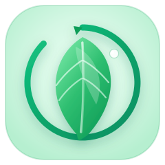

# 墨白风风格基座 — STYLE_GUIDE

> 架构演示图（docs/architecture/*.html）的**唯一风格依据**。本文件由「风格基座工程师」产出，供 6 张架构图的绘制者、审查整合工程师共同遵守。
>
> - 版本：v1.0（2026-08-25）
> - 来源：《docs/index.html》（白/浅色）、《docs/plugin_guide.html》（墨/深色）、《docs/evergreen-architecture.html》（明暗切换机制）
> - 品牌资源：`evg-base/assets/branding/`（已复制到 `_shared/branding/`）

---

## 0. 一句话定位

**墨白风 = 墨（前景/深色）与白（背景/浅色）两极构成的高对比、低饱和、克制的绿色强调。**

- 大块面只允许「墨」与「白」两种基本色（及它们的灰阶延伸），**绿色仅作少量强调**（`--evg-accent`）。
- 页面默认跟随系统明暗（`prefers-color-scheme`），同时支持手动切换（`data-theme` / `?theme=` / localStorage）。
- 品牌 logo 与宠物默认**黑白待机（灰度），悬停或周期放映时还原彩色**——这是两个参考页共同的核心动效语言。

---

## 1. 来源与继承

| 参考文件 | 贡献 |
|---|---|
| `docs/index.html` | 白（浅色）主题完整 token：`--ink #16181d` / `--paper #fafaf7` / `--accent #2f8f5b`、圆角 8/10/14/999px、卡片 hover 描边加深+阴影生长、logo 圆盘 `reelshow 6s` 悬浮放映、宠物 34px 灰阶 hover 彩色、`.badge` pre/stable/draft 三态 |
| `docs/plugin_guide.html` | 墨（深色）主题完整 token（oklch 体系）：`--bg oklch(15.5% .004 20)`、`--fg oklch(96% .002 20)`、`--accent oklch(68% .10 155)`、`--shadow-sm/md/lg`、`reel-ink 7s` 周期放映、`msg-in .25s` 入场、`pulse` 状态点、`prefers-reduced-motion` 全量降级、mono 字体栈 |
| `docs/evergreen-architecture.html` | 明暗切换工程机制：`<html data-theme>` + `?theme=` URL 参数 + localStorage + `matchMedia` 跟随系统 |

**共享气质**：墨白灰阶 + 单一绿色强调、1px 细边框、柔和小阴影、0.15–0.6s 的克制过渡、灰度→彩色「放映」动效。

---

## 2. 设计 Token

### 2.1 语义变量总表

所有组件**只消费语义层**（`--evg-bg` / `--evg-fg` / `--evg-accent` …），明暗两套取值由主题切换自动替换。`--evg-ink/--evg-paper` 是字面墨白原语，供特殊场景直用。

| 语义变量 | 白（light） | 墨（dark） | 用途 |
|---|---|---|---|
| `--evg-ink` | `#16181d` | `oklch(96% .002 20)` | 墨原语（前景） |
| `--evg-ink-2` | `#3a3f47` | `oklch(81% .004 20)` | 次级墨 |
| `--evg-ink-3` | `#4a5058` | `oklch(63% .005 20)` | 三级墨（图标细节） |
| `--evg-paper` | `#fafaf7` | `oklch(15.5% .004 20)` | 白原语（背景） |
| `--evg-paper-2` | `#f0f0ec` | `oklch(18.5% .005 20)` | 次级白 |
| `--evg-bg` | `#fafaf7` | `oklch(15.5% .004 20)` | 页面背景 |
| `--evg-bg-2` | `#f0f0ec` | `oklch(18.5% .005 20)` | 次级背景（分组底） |
| `--evg-panel` | `#f4f4f0` | `oklch(20.5% .005 20)` | 面板底（悬停态） |
| `--evg-panel-2` | `#e9e9e4` | `oklch(23.5% .006 20)` | 面板底 2（tag/进度轨） |
| `--evg-card` | `#ffffff` | `oklch(22.5% .005 20)` | 卡片底 |
| `--evg-card-hover` | `#ffffff` | `oklch(25.5% .006 20)` | 卡片悬停底 |
| `--evg-border` | `#dcdcd6` | `oklch(29% .007 20)` | 常规边框/连线 |
| `--evg-border-strong` | `#c6c6be` | `oklch(37% .008 20)` | 强边框/主要连线 |
| `--evg-fg` | `#16181d` | `oklch(96% .002 20)` | 主文字 |
| `--evg-fg-2` | `#3a3f47` | `oklch(81% .004 20)` | 次级文字 |
| `--evg-muted` | `#7a7f88` | `oklch(63% .005 20)` | 弱文字 |
| `--evg-muted-2` | `#9ca3af` | `oklch(49% .006 20)` | 最弱文字（mono 标签） |
| `--evg-accent` | `#2f8f5b` | `oklch(68% .10 155)` | 强调绿（**少量使用**） |
| `--evg-accent-strong` | `#3aa86b` | `oklch(74% .12 155)` | 强调悬停 |
| `--evg-accent-ink` | `#1f5c3c` | `oklch(74% .12 155)` | 强调上的墨字 |
| `--evg-accent-soft` | `rgba(47,143,91,.12)` | `oklch(68% .10 155/.14)` | 强调弱底（选中态） |
| `--evg-on-accent` | `#ffffff` | `oklch(99% 0 0)` | 强调底上的文字 |
| `--evg-success` | `#1f9d55` | `oklch(70% .12 150)` | 成功语义 |
| `--evg-success-soft` | `rgba(31,157,85,.12)` | `oklch(70% .12 150/.12)` | 成功弱底 |
| `--evg-warning` | `#b06a1f` | `oklch(78% .10 85)` | 警告语义 |
| `--evg-warning-soft` | `rgba(176,106,31,.14)` | `oklch(78% .10 85/.14)` | 警告弱底 |
| `--evg-danger` | `#b03a3a` | `oklch(66% .16 25)` | 危险语义（含 index.html `.status.error`） |
| `--evg-danger-soft` | `rgba(176,58,58,.12)` | `oklch(66% .16 25/.14)` | 危险弱底 |
| `--evg-violet` | `#6b5fc4` | `oklch(72% .12 295)` | 紫（少用，区分层次） |
| `--evg-violet-soft` | `rgba(107,95,196,.14)` | `oklch(72% .12 295/.14)` | 紫弱底 |
| `--evg-shadow-sm` | `0 1px 2px rgba(22,24,29,.04), 0 2px 10px rgba(22,24,29,.04)` | `0 1px 0 oklch(0% 0 0/.35)` | 默认卡片阴影 |
| `--evg-shadow-md` | `0 6px 18px rgba(22,24,29,.08)` | `0 8px 24px -8px oklch(0% 0 0/.5)` | 悬停/浮起 |
| `--evg-shadow-lg` | `0 10px 30px rgba(22,24,29,.10)` | `0 24px 60px -16px oklch(0% 0 0/.65)` | 浮层/移动端侧栏 |

> 墨色取 oklch 与 docs/plugin_guide.html 逐字一致；白色取 hex 与 index.html 逐字一致。组件代码里**不要写死颜色**，一律 `var(--evg-*)`。

### 2.2 字体栈

| Token | 值 |
|---|---|
| `--evg-sans` | `-apple-system, BlinkMacSystemFont, "Segoe UI", "PingFang SC", "Hiragino Sans GB", "Microsoft YaHei", Roboto, sans-serif` |
| `--evg-heading` | `-apple-system, BlinkMacSystemFont, "Segoe UI", "PingFang SC", "Microsoft YaHei", sans-serif` |
| `--evg-mono` | `"JetBrains Mono", ui-monospace, SFMono-Regular, Menlo, Consolas, monospace` |

- 正文/界面：`--evg-sans`，字号基准 `14px`、行高 `1.6`；标题用 `--evg-heading`。
- 端口、路径、状态、计数器、序号等**一律 mono**（`--evg-mono`），这是墨白风的识别特征。
- 不加载任何外部字体（本地优先，离线可用）。

### 2.3 圆角 / 边框

| Token | 值 | 用在 |
|---|---|---|
| `--evg-radius` | `8px` | 按钮、节点、分组、代码块 |
| `--evg-radius-lg` | `12px` | 卡片、面板、泳道 |
| `--evg-radius-xl` | `14px` | 大卡片、版本条 |
| `--evg-radius-full` | `999px` | 徽章、pill、进度轨、状态点 |
| 边框 | `1px solid var(--evg-border)` | 卡片/面板默认；hover 时描边 → `var(--evg-fg)` |
| 强调边 | `border-left: 3px solid var(--evg-accent)` 或 `2px`（callout） | 强调卡片/提示 |

### 2.4 动效节奏（动画 token）

| Token | 值 | 语义 |
|---|---|---|
| `--evg-dur-1` | `.15s` | 微交互（按钮、悬停） |
| `--evg-dur-2` | `.25s` | 面板/状态过渡（`msg-in` 同节奏） |
| `--evg-dur-3` | `.5s` | 入场、进度条 |
| `--evg-dur-4` | `.6s` | 灰度↔彩色滤镜过渡 |
| `--evg-dur-5` | `1.2s` | 虚线流动一个周期 |
| `--evg-ease` | `ease` | 默认缓动 |
| `--evg-ease-out` | `cubic-bezier(.2,0,0,1)` | 出场/浮起 |
| `--evg-reel` | `7s` | logo 周期放映（hero 可用 9s） |
| `--evg-float` | `6s` | 悬浮呼吸（`reelshow`） |
| `--evg-pulse` | `1.2s` | 状态点脉冲 |

内置关键帧（见 `_shared/evg-style.css`）：`evg-reel-ink`（灰度→彩色放映）、`evg-float`（上浮+微放大）、`evg-msg-in`（上移淡入）、`evg-dash`（虚线流动）、`evg-focus-pulse`（节点聚焦光环）、`evg-pulse`（呼吸）、`evg-breathe`（缩放呼吸）。

**动效铁律**：所有动画在 `@media (prefers-reduced-motion: reduce)` 下自动全部关闭（基座已内置）；动图演示用 4 类动效即可——放映（reel）、悬浮（float）、流动（dash-flow）、脉冲（pulse），不要做拖拽式连续动画。

---

## 3. 明暗双主题机制

优先级：**`?theme=` URL 参数 > localStorage（`evg-theme`）> 系统 `prefers-color-scheme`**。

- `evg-common.js` 自动初始化：页面加载即解析主题，`?theme=dark` 用于审查截图固定深色，不写 localStorage。
- 手动切换按钮：任何带 `data-evg-theme-toggle` 的元素即成为开关，点击后在 light/dark 间切换并持久化；`<span data-evg-theme-label>` 会同步显示「白/墨」。
- 跟随系统：用户未手动设置时，监听系统主题变化实时切换。
- CSS 侧由基座完成：`prefers-color-scheme` 媒体查询 + `:root[data-theme]` 覆盖，组件零改动。
- `color-scheme: light/dark` 已设置，原生滚动条/表单随主题。

主题切换按钮标准片段：

```html
<button type="button" class="evg-toggle" data-evg-theme-toggle aria-label="切换明暗主题">
  <span class="evg-toggle__dot"></span><span data-evg-theme-label>白</span>
</button>
```

---

## 4. 组件类速查（_shared/evg-style.css）

所有类前缀 `evg-`。HTML 组件与 SVG 组件（`<g>` + `<rect>` + `<text>`）共用同一套类名。

### 4.1 卡片 `.evg-card`
```html
<div class="evg-card evg-card--hover">
  <div class="evg-card__title">模块注册表</div>
  <div class="evg-card__sub">ModuleRegistry · seal 后只读</div>
  <div class="evg-card__body">正文……</div>
</div>
```
- `--hover`：hover 时描边加深 + 阴影升级（index.html `.version` 同款）。
- `--flat`：`--evg-bg-2` 底（index `.group` 分组款）；`--accent`：左 3px 绿边强调。

### 4.2 徽章 `.evg-badge`
```html
<span class="evg-badge evg-badge--stable">正式版</span>
<span class="evg-badge evg-badge--pre">预发布</span>
<span class="evg-badge evg-badge--draft">草稿</span>
<span class="evg-badge evg-badge--accent">核心</span>
<span class="evg-badge evg-badge--soft">HTML 插件</span>
<span class="evg-badge evg-badge--success">已注册</span>   <!-- 还有 --warning/--danger/--violet -->
<span class="evg-badge evg-badge--dot">运行中</span>      <!-- 带状态点 -->
```
三态（stable/pre/draft）继承 index.html；soft 与语义色继承 docs/plugin_guide.html 的 soft 底 + 实色字。

### 4.3 按钮 / pill / 键盘键
```html
<a class="evg-btn" href="#"><span>下载</span><span class="evg-btn__tag">正式</span><span class="evg-arrow">↓</span></a>
<a class="evg-btn evg-btn--primary" href="#">开始<span class="evg-arrow">→</span></a>
<span class="evg-pill"><strong>文档</strong><span>14 页 · 4 模块</span></span>
<span class="evg-kbd">←</span><span class="evg-kbd">→</span>
<code class="evg-code">platform.data.get('x')</code>
```
- `--primary`：绿底白字（welcome__ex--primary 同款）；普通按钮 hover 反白（index `a.btn:hover` 同款）。

### 4.4 节点 `.evg-node`（HTML 与 SVG 通用）
```html
<div class="evg-node evg-node--active">
  <span class="evg-node__title">数据中枢</span>
  <span class="evg-node__sub">DataOrchestrator</span>
</div>
```
```svg
<g class="evg-node evg-node--core" transform="translate(400 60)">
  <rect width="150" height="52" rx="12"/>
  <text x="75" y="24" text-anchor="middle" class="evg-node__title">数据中枢</text>
  <text x="75" y="40" text-anchor="middle" class="evg-node__sub">DataOrchestrator</text>
</g>
```
- 变体：`--core`（绿底白字，**每张图最多 1–2 个**）、`--active`（绿边+弱绿底=选中/当前）、`--accent`（仅绿边）、`--dim`（55% 透明度=待机）、`--clickable`（hover 上浮）、`--focus`（聚焦光环脉冲）。
- SVG 用法：类加在 `<g>` 上，基座自动为子 `rect`/`text` 上色；几何尺寸由属性控制。

### 4.5 箭头与连线（箭头/连线基座）
```html
<span class="evg-arrow evg-arrow--accent">→</span>
```
```svg
<path class="evg-edge" d="M120 80 L300 80" marker-end="url(#evg-arrowhead)"/>
<path class="evg-edge evg-edge--flow" d="M120 120 L300 120" marker-end="url(#evg-arrowhead)"/>
<path class="evg-edge evg-edge--ghost" d="M120 160 L300 160"/>   <!-- 虚线待命 -->
```
- `--flow`：绿色虚线向前流动（`evg-dash` 1.2s），表达数据/请求流动，**这是动图演示的主力**。
- `--ghost`：灰虚线，表达「待接入/可选」。
- `--active` / `--thick`：绿实线 / 加粗。
- 箭头标记规范见 §5。

### 4.6 泳道 `.evg-lane`
```html
<div class="evg-lanes">
  <div class="evg-lane">
    <div class="evg-lane__head"><span class="evg-dot evg-dot--accent"></span>数据层<span class="evg-badge evg-badge--soft evg-lane__tag">4 源</span></div>
    <div class="evg-lane__body"><!-- 节点/卡片们 --></div>
  </div>
  <!-- 更多泳道 -->
</div>
```
- `.evg-lanes` 纵向堆叠（gap 14px）；每道 = 头（`--evg-panel` 底 + 下边框）+ 体（可横排节点，gap 12px）。
- 状态点 `.evg-dot`：`--accent/--fg/--success/--warning/--danger/--violet`。

### 4.7 思维导图连线 `.evg-mind`
```html
<div class="evg-mind">
  <div class="evg-mind__center evg-node evg-node--core">…中心…</div>
  <svg class="evg-mind__lines"><!-- JS 用 EVG.curvePath 生成分支 --></svg>
  <div class="evg-mind__branch"> <div class="evg-node">…子节点…</div> </div>
</div>
```
- `.evg-mind__center`：放大版核心节点；分支连线用 `EVG.curvePath()` 生成贝塞尔（见 §5），类 `.evg-mind__branch`（= `--evg-border-strong` 实线）或 `--active`（绿流动）。
- 每张思维导图**只有一个中心**，其余全为普通节点。

### 4.8 提示 / 进度 / 文本
```html
<div class="evg-callout"><span class="evg-callout__ic">💡</span><span><b>关键结论：</b>……</span></div>
<div class="evg-progress"><div class="evg-progress__fill" style="width:60%"></div></div>
<div class="evg-title evg-h1">标题</div>
<span class="evg-muted">弱文字</span> <span class="evg-accent-text">强调</span>
```
- callout 四色可配 `--success/--warning/--danger/--violet` 左边条（继承 docs/plugin_guide `.tip`）。

### 4.9 品牌放映与宠物（动图演示核心）
```html

```
- `.evg-reel`：默认灰度（`grayscale(1) contrast(1.08)`），hover 还原彩色；`--auto` 加 7s 周期放映（82% 后渐显彩色）。
- `.evg-reel--on`：强制常彩（如「正在运行」状态）。
- 宠物：``（默认 34px，`--sm` 22px / `--md` 26px），灰阶 opacity .55，hover 彩色满显。
- logo 圆盘容器：`.evg-brand-disc`（108px 白/卡片底圆盘 + `--evg-shadow-md`），配 `.evg-float` 悬浮呼吸。

### 4.10 滚动入场 / 数字动画
```html
<div class="evg-reveal" data-delay="120">…</div>
<div class="evg-reveal evg-reveal--left">…</div>   <!-- 变体：--right / --scale -->
```
- `evg-common.js` 用 IntersectionObserver 进入视口时加 `is-visible`；`data-delay`（ms）错峰。
- 数字滚动：`EVG.countUp(el, 128, 900)`（0→128，900ms，rAF）。
- 计数类展示建议 mono 字体 + `evg-accent-text`。

---

## 5. SVG 连线与箭头规范

1. **箭头标记**（每页定义一次，隐藏 defs SVG，全页引用同一 id）：
```html
<svg width="0" height="0" style="position:absolute" aria-hidden="true">
  <defs>
    <marker id="evg-arrowhead" class="evg-arrowhead" viewBox="0 0 10 10" refX="8" refY="5" markerWidth="7" markerHeight="7" orient="auto-start-reverse">
      <path d="M0 0 L10 5 L0 10 z"/>
    </marker>
  </defs>
</svg>
```
路径用 `marker-end="url(#evg-arrowhead)"`；颜色由基座 `.evg-arrowhead path { fill: var(--evg-accent) }` 自动随主题。
2. **连线样式**：默认 `.evg-edge`（细灰实线）→ 语义线；`.evg-edge--flow`（绿流动）→ 数据/请求；`.evg-edge--ghost`（灰虚线）→ 可选/待接入；`.evg-edge--active`（绿实线）→ 当前高亮。
3. **曲线**：思维导图/流程用水平贝塞尔：`EVG.curvePath(x1, y1, x2, y2, bend)`（bend 默认 0.5；0=直线），返回 `d` 字符串。
4. **SVG 内文字**：`<text>` 直接继承 `--evg-sans`；需 mono 时加 `class="evg-mono"`（`--evg-mono` 已对 `svg text.evg-mono` 生效）。SVG 里不要用 HTML 实体逃逸中文，直接写 UTF-8。
5. **SVG 尺寸**：主图建议 `viewBox="0 0 1200 720"`，`width="100%"`、`height="auto"`，容器 `.evg-container` 限宽。

---

## 6. 品牌资源使用约定（_shared/branding/）

已复制 5 个文件（源：`evg-base/assets/branding/`）：

| 文件 | 内容 | 建议用途 |
|---|---|---|
| `logo.svg` | 彩色绿 logo（240×240，渐变+柔光） | 白背景 hero/页眉，`.evg-reel` 灰度放映；hover/放映还原彩色 |
| `logo-ink.svg` | 墨白灰阶 logo（深墨盘+浅灰图形） | **墨（深色）背景首选**；页脚、水印、深色卡片内静态展示 |
| `pet.svg` | 绿芽精灵（200×200 彩色） | 页脚宠物排（与 index.html 三宠同构），`.evg-pet` 灰阶待机 |
| `pet_leafcat.svg` | 叶灵猫（200×200 彩色） | 同上；「Agent/守护」语境可做主题宠物 |
| `pet_sleep.svg` | 睡眠款（200×200 彩色） | 同上；「待机/空闲」语义 |
| （参考页内置简化版 logo） | 环+叶 currentColor 单色 | 需要继承 `currentColor` 的小图标场景（侧栏/徽章内）才用，不在本目录 |

约定：

- **引入方式**：默认 ``；CSS 灰度滤镜对 `` 同样生效，无需内联。需要随主题换色的极小场景才内联 SVG，且注意 **defs 渐变 id 全页唯一**（多份 logo.svg 同页会 id 冲突——同页第二个 logo 请改用 `logo-ink.svg` 或 `` 方式）。
- **明暗选型**：白背景用 `logo.svg`（放映模式）或 `logo-ink.svg`（静态墨白）；深色背景**优先 `logo-ink.svg`**（彩色版浅绿盘在深底上会刺眼），或 `logo.svg` + 低透明度。
- **尺寸**：hero 圆盘 108×108（logo 内 84）、文档头 48×48（内 28）、页脚 34×34、侧栏 26×26、内联小标 17×17。
- **动效**：logo 与宠物一律「灰度待机 → 悬停/放映彩色」；不要做无灰度直接彩色的静态展示（破坏墨白语言），除非该元素本身就是「强调进行中」（用 `--on`）。
- **无障碍**：`` 必须给 `alt`；装饰性宠物可 `aria-hidden="true"`。

---

## 7. 动图演示约定

| 动效 | 类/函数 | 节奏 | 用在哪 |
|---|---|---|---|
| 放映（灰↔彩） | `.evg-reel--auto` | 7s（hero 9s） | logo、宠物（hover） |
| 悬浮呼吸 | `.evg-float` | 6s alternate | logo 圆盘、核心节点微浮 |
| 虚线流动 | `.evg-edge--flow` | 1.2s linear infinite | 数据流/请求流连线 |
| 聚焦光环 | `.evg-node--focus` | 2s ease-out infinite | 「当前执行」节点 |
| 状态点脉冲 | `.evg-pulse` | 1.2s | 运行/忙碌状态点 |
| 入场错峰 | `.evg-reveal` + `data-delay` | 50–300ms 递增 | 滚动演示节点逐个亮起 |
| 数字滚动 | `EVG.countUp()` | 800–1200ms | 计数器/指标 |

- 动图节奏统一用 token（§2.4），不要自造时长。
- 每张图动效 ≤ 3 类，突出一个主视觉流即可；`prefers-reduced-motion` 下全部静止（基座已处理）。
- 明暗切换本身也是演示点：鼓励每张图右上角放 `.evg-toggle`，审查时固定 `?theme=dark/light` 截图。

---

## 8. 如何接入

目录结构：

```
docs/architecture/
├── STYLE_GUIDE.md            ← 本文档
├── _shared/
│   ├── evg-style.css         ← 主题变量 + 组件类 + 动效（唯一样式依赖）
│   ├── evg-common.js         ← 主题切换 + 滚动入场 + 工具函数
│   ├── preview.html          ← 风格基座预览/自查页（不是架构图）
│   └── branding/             ← logo ×2 + pet ×3（复制自 evg-base/assets/branding/）
├── data-hub.html             （T2）
├── agent-architecture.html   （T3）
├── flywheel.html / workshops.html（T4）
├── agent-workflow.html / three-view.html（T5）
└── index.html                （T6 统一入口）
```

页面骨架：

```html
<!DOCTYPE html>
<html lang="zh-CN">
<head>
  <meta charset="UTF-8" />
  <meta name="viewport" content="width=device-width, initial-scale=1" />
  <title>数据中枢 · 架构演示</title>
  <link rel="stylesheet" href="_shared/evg-style.css" />
</head>
<body>
  <header>…（logo `.evg-reel` + 标题 + `.evg-toggle`）…</header>
  <main class="evg-container">…</main>
  <script src="_shared/evg-common.js"></script>
</body>
</html>
```

- 相对路径从 `docs/architecture/` 出发；若图被移到别处，调整 `_shared/` 前缀即可（文件本身无内部依赖）。
- 独立双击打开（file://）即可工作，无需服务器；localStorage 不可用时静默降级为跟随系统。

---

## 9. 交付物清单与自查

| # | 交付物 | 状态 |
|---|---|---|
| 1 | `STYLE_GUIDE.md`（本文档） | ✅ |
| 2 | `_shared/evg-style.css`（明暗变量 + 卡片/徽章/箭头/节点/泳道/思维导图连线 + 动效） | ✅ |
| 3 | `_shared/evg-common.js`（明暗切换 / 滚动入场 / countUp / SVG 路径与标记工具） | ✅ |
| 4 | `_shared/branding/`（logo.svg、logo-ink.svg、pet.svg、pet_leafcat.svg、pet_sleep.svg） | ✅ |
| 5 | `_shared/preview.html`（组件与双主题自查页） | ✅ |

绘制者自查（t2–t5 完成前逐条勾过）：

- [ ] 页面 `<link>` 引用 `_shared/evg-style.css`，`<script>` 引用 `_shared/evg-common.js`
- [ ] 颜色全部走 `var(--evg-*)`，无硬编码色值（SVG fill/stroke 同理）
- [ ] 主题切换按钮用 `data-evg-theme-toggle`；明暗两态截图检查
- [ ] 组件只用 §4 所列类；SVG 连线遵循 §5
- [ ] logo/宠物用 `_shared/branding/`，灰度放映模式
- [ ] 动效遵循 §7 节奏 token；`prefers-reduced-motion` 下可读
