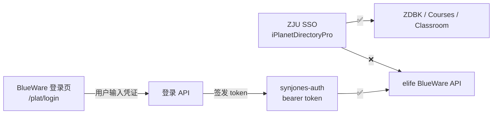

# Ecard — BlueWare 平台认证 (WIP)

> 一卡通校园卡余额查询功能，当前标记为"开发中"。
> 原因是 elife 平台已迁移到 **慧新E校.新中新 (BlueWare)**，其 API 使用独立的 `synjones-auth` token 认证，
> 与 ZJU 统一认证 (`iPlanetDirectoryPro` SSO cookie) **不互通**。

---

## 1. 背景

- **业务**：查询一卡通余额
- **API**：`GET /berserker-app/ykt/tsm/getCampusCards?synAccessSource=pc`
- **主机**：`elife.zju.edu.cn`
- **平台**：BlueWare（慧新E校.新中新，北京新中新诚通信息技术股份有限公司）
- **版本**：1.07.fix (2023/12/29)

## 2. 认证架构



### 2.1 已确认的事实

| 项目 | 结论 |
|------|------|
| BlueWare API 不接受 SSO cookie | `Cookie: iPlanetDirectoryPro=xxx` → **401 缺失令牌** |
| `synjones-auth` 头格式正确 | `synjones-auth: bearer <token>` → **401 请求未授权**（说明格式被识别但 token 无效） |
| `_loginElife()` 仅保存了 1 个 cookie | 对比 Courses(14) 和 Classroom(13)，elife 不返回任何 Set-Cookie |
| `/berserker-base/redirect` 重定向到登录页 | 301 → `/plat/login?loginFrom=app&type=login`（Vue.js SPA） |
| 带上 SSO cookie 访问登录页 | 返回 HTML 页面，**不自动登录** |

### 2.2 关键 JS 代码片段

源自 `/plat/js/app.31960290.js`（plat-pc 版本）和 `/plat/js/app.7735d723.css`（plat 版本）：

```javascript
// API 拦截器 — 所有请求携带 synjones-auth token
r.interceptors.request.use(e => {
    const n = {
        token: store.state.token,
        token_type: store.state.token_type || "bearer"
    };
    if (n.token) {
        e.headers["synjones-auth"] = `${n.token_type} ${n.token}`;
    }
    return e;
});

// Token 来源 — Vuex store 或 URL 参数
const token = store.state.token || getQueryParam("synjones-auth");

// 无 token 时重定向到登录
if (!token) {
    const loginUrl = configs.base + "/berserker-base/redirect?type=login&loginFrom=app";
    window.location.href = loginUrl;
}
```

## 3. API 认证流程（需要实现）

BlueWare 为 ZJU 用户提供了独立的账号系统。获取 token 的可能路径：

### 方案 A：模拟登录 API（推荐）

1. 找出 BlueWare 登录 API（`POST /plat/api/login` 或类似）
2. 用 ZJU 学号和密码直接 POST 登录
3. 从响应中提取 `synjones-auth` token
4. 缓存到 `AuthState` 或 `PersistCookieJar`

**需要逆向的内容：**
- 登录 API 端点（从 `plat/js/app.31960290.js` 或 `plat/js/login~signup.4886378d.js` 中提取）
- 请求参数格式（账号/密码字段名、加密方式）
- 响应格式

### 方案 B：CAS 委托登录

检查 BlueWare 是否支持 CAS 回调：

```
GET /plat/api/login/cas?ticket=ST-...&service=...
```

如果能找到 CAS 回调端点，可以通过 ZJUAM 的 service ticket 直接获取 BlueWare token。

### 方案 C：手动 Cookie 注入

1. 用户在浏览器中手动登录 elife（一次）
2. 从浏览器 `localStorage` 中复制 `access_token` 值
3. 写入应用配置或 `.cookies/` 目录
4. 后续 API 携带该 token

## 4. 现有代码结构

```
lib/features/ecard/
├── providers/
│   └── ecard_provider.dart      # Riverpod provider（可用，缺 token）
├── screens/
│   └── ecard_screen.dart        # 一卡通页面（可用，缺 token）
├── ...

lib/features/auth/services/
└── auth_service.dart
    └── _loginElife()            # 登录函数（暂禁用，保留代码）

lib/core/agent/tools/
└── zju_ecard.dart               # AI Agent 工具定义

lib/widgets/
├── dashboard.dart               # 显示"开发中"卡片
└── sidebar.dart                 # 标记"一卡通(开发中)"
```

### 4.1 恢复步骤

```dart
// 1. app.dart — 恢复路由
GoRoute(
  path: '/ecard',
  pageBuilder: (context, state) => _fadePage(EcardScreen(), state),
),

// 2. auth_service.dart — 恢复自动登录
results['Elife'] = await _safeLogin(() => _loginElife(ssoCookie));

// 3. sidebar.dart — 移除 (开发中) 标记
_NavItem(icon: Icons.credit_card, label: '一卡通', path: '/ecard', current: location),

// 4. dashboard.dart — 恢复 _ecardCard
//    + 恢复 import '../features/ecard/providers/ecard_provider.dart';
```

## 5. Cookie Jar 结构

BlueWare 的 `synjones-auth` token 应存入 `PersistCookieJar` 供各 provider 共享：

```dart
// 存入
await jar.saveFromResponse(
  Uri.parse('https://elife.zju.edu.cn'),
  [Cookie('synjones-auth', token)],
);

// 读取
final cookies = await jar.loadForRequest(Uri.parse('https://elife.zju.edu.cn'));
for (final c in cookies) {
  if (c.name == 'synjones-auth') { /* 使用 c.value */ }
}

// API 请求
headers['synjones-auth'] = 'bearer $token';
```

## 6. curl 调试命令

```bash
# 测试 API（无认证 → 401）
curl -s -D - "https://elife.zju.edu.cn/berserker-app/ykt/tsm/getCampusCards?synAccessSource=pc"

# 测试重定向链
curl -s -D - -L "https://elife.zju.edu.cn/berserker-base/redirect?type=login&loginFrom=app"

# 带 SSO cookie 测试
curl -s -D - -L "https://elife.zju.edu.cn/berserker-base/redirect?type=login&loginFrom=app" \
  -H "Cookie: iPlanetDirectoryPro=<SSO_TOKEN>"

# 带 synjones-auth token 测试
curl -s -D - "https://elife.zju.edu.cn/berserker-app/ykt/tsm/getCampusCards?synAccessSource=pc" \
  -H "synjones-auth: bearer <TOKEN>"
```

## 7. 参考

- 慧新E校: https://elife.zju.edu.cn/plat-pc/
- JS App 文件: `/plat/js/app.31960290.js`
- JS 登录块: `/plat/js/login~signup.4886378d.js`
- 调试手册: `/test/network_debug_guide.md` (F 节)
