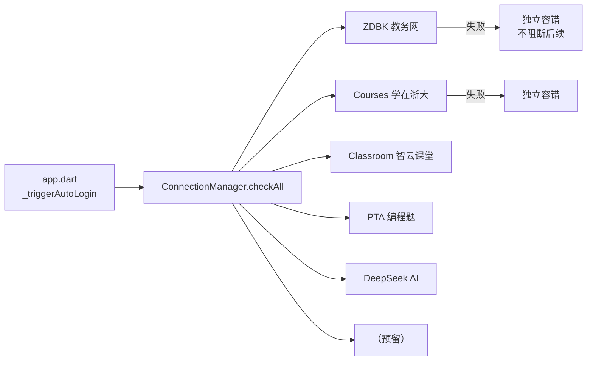
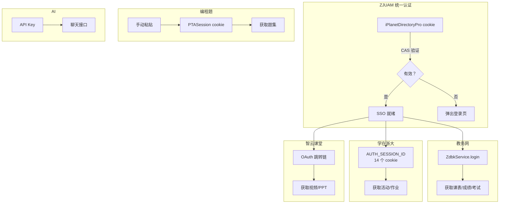

# 11 — 自动登录链可靠性

**层级：** 三 | **估时：** 2 天 | **依赖：** 09 登录重构

---

## 1. 架构现状



### 1.1 核心组件

| 组件 | 位置 | 职责 |
|------|------|------|
| `ConnectionManager` | `core/connectivity/connection_manager.dart` | 编排所有服务登录，支持全量/单项检查 |
| `ConnectionResult` | 同上 | 每项检查的结果（service / ok / message / elapsed） |
| `connectivityCheckProvider` | `connectivity/providers/connectivity_provider.dart` | 全量检查的 Riverpod provider |
| `connectionManagerProvider` | 同上 | 暴露 Manager 实例供逐项重试 |
| `RetryInterceptor` | `core/network/retry_interceptor.dart` | 网络层自动重试（3 次，jitter 退避，30s 上限） |
| `ZdbkService._withAutoRelogin` | `zdbk/services/zdbk_service.dart` | ZDBK 专属：检测 session 过期自动重新登录 |

### 1.2 当前服务和检查方式

```dart
// ConnectionManager.checkAll() 中的检查方法
services = [
  'ZDBK 教务网',    // ZdbkService.login() — 通过 SSO cookie 登录
  'Courses 学在浙大', // AuthService.loginCourses() — CAS 跳转链
  'Classroom 智云课堂', // AuthService.loginClassroom() — OAuth 跳转链
  'PTA 编程题',      // PintiaService.hasValidSession() — 检查 PTASession 有效性
  'DeepSeek AI',    // AppConfig.deepseekApiKey 存在性检查
]
```

---

## 2. 失败重试策略

### 2.1 网络层（已实现）

`RetryInterceptor` 对所有 Dio 请求生效：

```
请求失败
  └─ 可重试状态码？(429, 502, 503) ─否→ 透传错误
       └─ 是 → 重试次数 < 3？
            └─ 是 → 等待 delayMs (jitter 退避, 上限 30s)
            └─ 否 → 透传错误
```

### 2.2 应用层（已实现）

`ConnectionManager` 中每项检查独立 `try/catch`，互不阻断：

```dart
// 伪代码：checkAll 的容错模式
for (final service in services) {
  try {
    await login(service);      // 失败只影响该项
  } catch (e) {
    results.add(ConnectionResult(ok: false, message: e));
  }
}
```

### 2.3 重试触发（已实现）

| 触发方式 | 位置 |
|---------|------|
| 启动时自动执行 | `app.dart:_triggerAutoLogin()` → `manager.checkAll()` |
| 快速连接页面 | 侧边栏「快速连接」→ 全量检查 + 逐项重试按钮 |
| Dashboard 卡片 | 点击「快速连接」卡片 → 跳转到快速连接页面 |

---

## 3. 待实现功能

### 3.1 SSO Cookie 过期检测

**现状：** 每次 `ensureAuth()` 调用 `_validateCookie()` 检查 SSO cookie 是否有效，但不记录过期时间。

**做法：**

```dart
// AuthState 中新增字段
class AuthState {
  final bool isLoggedIn;
  final Cookie? ssoCookie;
  final DateTime? ssoExpiresAt;  // ← 新增：从 Set-Cookie 的 Expires/Max-Age 提取
  final AppError? error;
}

// 提取过期时间
DateTime? _parseExpiry(Cookie cookie) {
  if (cookie.expires != null) return cookie.expires;
  if (cookie.maxAge != null) return DateTime.now().add(Duration(seconds: cookie.maxAge!));
  return null;
}
```

**验收：** `AuthState.ssoExpiresAt` 有值，且在距过期 < 10 分钟时触发主动刷新。

### 3.2 启动时主动刷新即将过期的 Session

**现状：** 启动时只做 `restoreSession()` + `checkAll()`，不检查过期时间。

**做法：**

```dart
// _triggerAutoLogin 中增加
Future.microtask(() async {
  final authNotifier = ref.read(authProvider.notifier);
  final loggedIn = await authNotifier.ensureAuth();
  if (!loggedIn) return;

  // 检查 SSO cookie 是否即将过期
  final state = ref.read(authProvider);
  if (state.ssoExpiresAt != null &&
      state.ssoExpiresAt!.difference(DateTime.now()).inMinutes < 10) {
    Log().info('SSO cookie expiring soon, refreshing...');
    await authNotifier.login();  // 重新登录刷新 cookie
  }

  // 然后执行统一连接检查
  final manager = ConnectionManager(...);
  await manager.checkAll();
});
```

**验收：** 启动日志显示 `SSO cookie expiring soon, refreshing...` 并成功刷新。

### 3.3 用户修改密码后自动重连

**现状：** 用户修改了 ZJU 密码后，旧 session 过期，所有服务失效。用户需要手动重新登录。

**做法：** `AuthInterceptor.onError` 检测到 401 时，触发 `ConnectionManager.checkAll()` 而非只触发 CAS 重新登录。

```dart
// AuthInterceptor 修改：检测到 session 过期后，
// 先调 onRelogin() 刷新 SSO，成功后调 checkAll() 重连所有服务
```

**验收：** 密码修改后，重输一次密码即可恢复所有服务连通。

---

## 4. 如何新增一个服务

### 4.1 步骤

```dart
// 1. 在 ConnectionManager 的 checkOne() switch 中添加 case
case '新服务名':
  return await _check('新服务名', () async {
    // 调用对应的 Service 方法
    await someService.login();
  });

// 2. 在 checkAll() 的 services 列表中添加名称
final services = [
  'ZDBK 教务网',
  '...',
  '新服务名',
];

// 3. 在 Dashboard 卡片中如果不需要特别展示，无需额外改动
//    快速连接页面会自动显示新服务的检查结果
```

### 4.2 检查模板

```dart
/// 耗时检查（异步，用于 HTTP 请求等）
return await _check('服务名', () async {
  final result = await service.someMethod();
  if (!result.ok) throw Exception(result.error ?? '失败');
});

/// 瞬时检查（同步，用于本地配置存在性检查）
return _result('服务名', () {
  if (config == null) throw Exception('未配置');
});
```

---

## 5. 各服务认证链路一览



---

## 6. 验收清单

- [x] `ConnectionManager` 统一管理所有服务的自动登录
- [x] 每项检查独立容错，失败不阻断后续
- [x] 快速连接页面支持全量检查 + 逐项重试
- [x] 网络层自动重试（3 次，jitter 退避，30s 上限）
- [x] SSO cookie 过期时间提取（`AuthState.ssoExpiresAt`）
- [x] 启动时距过期 < 10 分钟主动刷新
- [x] 用户修改密码后自动重连所有服务
- [x] `AuthState.parseExpiry` 单元测试（6 用例）
- [ ] 连续重登 3 轮不崩溃（需集成测试）
