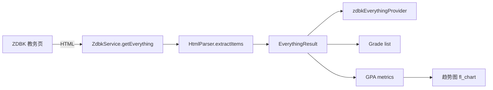

# 13 — Scores 成绩

**层级：** 四 | **估时：** 4 天 | **依赖：** 10 ZDBK

---

## 1. 现状

成绩页面已实现核心读写功能，数据源为 ZDBK（教务网）`zdbkEverythingProvider`。

### 1.1 已实现

| 功能 | 状态 |
|------|:----:|
| GPA 概览卡片（五分制/四分制4.3/四分制4.0/百分制） | ✅ |
| 策略切换（保研=首次 / 出国=最高分） | ✅ |
| GPA 各学期趋势折线图（`fl_chart`） | ✅ |
| 成绩明细列表（`ListView.builder` 懒加载） | ✅ |
| 学期筛选器（DropdownButton） | ✅ |
| 成绩搜索/过滤输入框 | ✅ |
| 已获得学分统计 | ✅ |
| loading / empty / error / data 四态覆盖 | ✅ |
| 刷新按钮 | ✅ |

### 1.2 待实现

| 优先级 | 功能 | 说明 |
|:------:|------|------|
| P2 | 课程详情跳转 | 点击成绩行跳转到学在浙大详情页 |

---

## 2. 技术方案

### 2.1 数据流



### 2.2 GPA 趋势图

从成绩课程 ID 中提取学期（`(2024-2025-1)-CS101-001` → `2024-2025-1`），按学期分组计算平均五分制 GPA，使用 `fl_chart` 绘制折线图。至少两个学期才显示。

```dart
fl_chart LineChart(
  spots: [FlSpot(0, 4.5), FlSpot(1, 4.2), ...],
  isCurved: true,
  belowBarData: BarAreaData(show: true, color: primary.withAlpha(25)),
)
```

### 2.3 学期筛选器

从课程 ID（`xkkh`）的正则 `\(([^)]+)\)` 提取学期标识，去重排序后作为 `DropdownButtonFormField` 选项。

### 2.4 成绩搜索

使用 `TextField` + `onChanged` 按课程名称、原始成绩文本模糊过滤。

### 2.5 懒加载

使用 `ListView.builder` 替代 `...grades.map` 全量渲染，大列表 60fps 滚动。

### 2.6 待实现详情

**成绩分布柱状图：** 按五分制区间（0-1, 1-2, 2-3, 3-4, 4-5）统计课程数量，绘制柱状图：

```dart
BarChart(
  BarChartData(
    barGroups: bins.map((b) => BarChartGroupData(x: b.index, barRods: [
      BarChartRodData(toY: b.count, color: ...),
    ])).toList(),
  ),
)
```

---

## 3. 实现顺序

| 步骤 | 内容 | 状态 |
|:----:|------|:----:|
| 1 | `ListView.builder` 懒加载 | ✅ |
| 2 | 学期筛选器 | ✅ |
| 3 | 成绩搜索/过滤 | ✅ |
| 4 | GPA 趋势图（`fl_chart`） | ✅ |
| 5 | 成绩分布柱状图 | ⬜ |
| 6 | 离线缓存优先策略 | ⬜ |
| 7 | 课程详情跳转 | ⬜ |

---

## 4. 验收标准

- [x] 超过 50 门成绩的列表滚动 60fps
- [x] 学期筛选器正常工作
- [x] GPA 趋势图展示至少两个学期的对比
- [ ] 成绩分布柱状图展示分数段统计数据
- [ ] 断网时展示缓存数据
- [ ] 全部现有 200+ 测试通过
