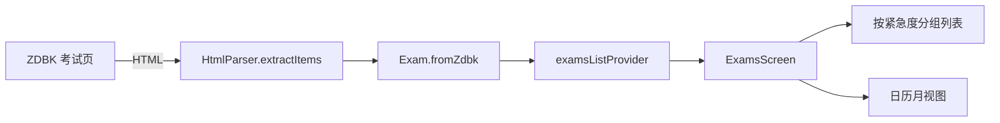

# 15 — Exams 考试

**层级：** 四 | **估时：** 3 天 | **依赖：** 10 ZDBK

---

## 1. 现状

考试页面已实现基础功能，数据源来自 ZDBK（教务网），学在浙大为回退源。

### 1.1 已实现

| 功能 | 状态 |
|------|:----:|
| 考试列表按紧急度分组（7天内/30天内/后续/已结束） | ✅ |
| 颜色编码卡片（红/橙/蓝/灰） | ✅ |
| 倒计时天数显示 | ✅ |
| 考试时间 + 地点展示 | ✅ |
| loading / empty / error 四态覆盖 | ✅ |
| 数据源：ZDBK 优先，courses.zju.edu.cn 回退 | ✅ |
| `ref.watch(authProvider)` 自动重跑 | ✅ |

### 1.2 待实现

| 优先级 | 功能 | 说明 |
|:------:|------|------|
| **P0** | **倒计时精确到秒** | 即将到来的考试显示 "2天 3小时 25分" 而非仅天数 |
| **P0** | **日历月视图** | 以日历形式展示当月考试分布，直观查看考试日期 |
| P1 | 考试详情弹窗 | 点击考试卡片展开详情（座位号、备注等） |
| P1 | iCal 导出 | 一键导出考试日程到系统日历 |
| P2 | 考试提醒通知 | 考前 1 天/1 小时推送系统通知 |
| P2 | 搜索/过滤 | 按课程名称、考试类型筛选 |

---

## 2. 技术方案

### 2.1 精确倒计时

当前 `_countdownText` 只显示天数。改为显示年/月/天/小时/分钟：

```dart
String get countdownText {
  if (exam.startTime == null) return '';
  final diff = exam.startTime!.difference(DateTime.now());
  if (diff.isNegative) return '已结束';

  final parts = <String>[];
  if (diff.inDays > 0) parts.add('${diff.inDays}天');
  final hours = diff.inHours % 24;
  if (hours > 0 || diff.inDays > 0) parts.add('${hours}小时');
  final minutes = diff.inMinutes % 60;
  parts.add('${minutes}分');

  return parts.join(' ');
}
```

对于 7 天内的考试，显示精确到秒的倒计时（可选），使用 `Timer.periodic` 每秒刷新。

### 2.2 日历月视图

使用 `table_calendar` 或手写网格渲染：

```dart
// 使用 table_calendar（需添加依赖）或手写 GridView
CalendarDatePicker(
  initialDate: DateTime.now(),
  firstDate: DateTime.now().subtract(const Duration(days: 30)),
  lastDate: DateTime.now().add(const Duration(days: 180)),
  onDateSelected: (d) => _showExamsOnDate(d),
)
```

**手写方案（无额外依赖）：**

```dart
GridView.count(
  crossAxisCount: 7,
  children: days.map((d) {
    final examsOnDay = exams.where((e) => _isSameDay(e.startTime, d));
    return Badge(
      isLabelVisible: examsOnDay.isNotEmpty,
      child: Text('${d.day}'),
    );
  }).toList(),
)
```

考试日期在日历上以圆点/标记显示，点击日期显示该日考试列表。

### 2.3 数据流



### 2.4 视图切换

在 AppBar 添加 `SegmentedButton` 切换列表/日历视图：

```dart
SegmentedButton<ExamView>(
  segments: [
    ButtonSegment(value: ExamView.list, label: Text('列表')),
    ButtonSegment(value: ExamView.calendar, label: Text('日历')),
  ],
  selected: {_view},
  onSelectionChanged: (v) => setState(() => _view = v.first),
)
```

---

## 3. 实现顺序

| 步骤 | 内容 | 估时 |
|:----:|------|:----:|
| 1 | 精确倒计时（天/时/分） | 0.3 天 |
| 2 | 日历月视图基础网格 | 0.8 天 |
| 3 | 考试详情弹窗（座位号 + 备注） | 0.3 天 |
| 4 | iCal 导出 | 0.5 天 |
| 5 | 考试提醒通知 | 0.5 天 |
| 6 | 搜索/过滤 | 0.3 天 |

---

## 4. 验收标准

- [ ] 倒计时显示天/时/分，7 天内精确到秒
- [ ] 日历月视图正确标记考试日期
- [ ] 点击日历日期显示该日考试列表
- [ ] loading / empty / error / data 四态覆盖
- [ ] 全部现有 200+ 测试通过
