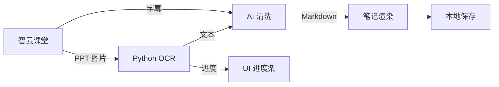

# 19 — Tutor AI 笔记 + OCR

**层级：** 六 | **估时：** 6 天 | **依赖：** 09 登录, 10 ZDBK | **关联 Bug：** BUG-02,05,07,08

---

## 1. 现状

AI 笔记页面已实现核心流程：输入 → AI 生成 → Markdown 渲染。OCR 识别和智云课堂集成也已基础可用。

### 1.1 已实现

| 功能 | 状态 |
|------|:----:|
| 输入框 + 模式选择（学霸笔记/快闪卡片） | ✅ |
| AI 流式生成 + Markdown 渲染 | ✅ |
| 思维导图 / 数学公式渲染 | ✅ |
| Markdown 容错（代码块配对、防崩溃） | ✅ |
| 智云课堂视频导入（选课 → 选视频） | ✅ |
| PPT OCR 识别（Python 脚本，批处理） | ✅ |
| ASC 字幕提取 | ✅ |
| AI 清洗（流式特效面板） | ✅ |
| 查看器 → 笔记一键导入（`fetchClassroomContent`） | ✅ |
| 视频进度记忆（`SharedPreferences`） | ✅ |

### 1.2 待实现

| 优先级 | 功能 | 说明 |
|:------:|------|------|
| **P0** | **BUG-02：全链路修复** | OCR → 文本 → 清洗 → Markdown → 保存，各环节断裂点 |
| **P0** | **`setState()` during build 崩溃** | `notes_screen.dart` `initState` 中 `FlutterError.onError` 触发 `setState` 导致布局崩溃 |
| **P1** | **BUG-05：笔记持久化** | AI 生成笔记保存到本地文件，重启 App 后仍在 |
| **P1** | **BUG-07：OCR 纠错词典** | 常见 OCR 错字（如"井"→"并"）自动纠正映射表 |
| **P1** | **BUG-08：OCR 并行加速** | 多线程（4 线程）并行识别 PPT 图片 |
| **P2** | **笔记渲染优化** | 内容卡片更美观，支持主题切换 |
| **P2** | **DeepSeek API key 有效性检测** | 设置页输入 key 后自动验证 |
| **P2** | **对话历史持久化** | AI 对话记录保存到本地数据库 |

---

## 2. 技术方案

### 2.1 BUG-02：全链路修复



**断裂点排查：**

| 环节 | 问题 | 修复 |
|------|------|------|
| OCR → 文本 | 查看器导入未跑 OCR | 已修复：改为走 `fetchClassroomContent` |
| 清洗 → Markdown | 清洗面板 UI 触发 `setState()` during build | 待修复：见 2.2 |
| Markdown → 渲染 | `flutter_markdown` 空断言崩溃 | 已有容错；可进一步用 `SelectableText` 回退 |
| 渲染 → 保存 | 笔记未持久化 | 待实现：见 BUG-05 |

### 2.2 `setState()` during build 崩溃

**根因：** `initState` 中设置 `FlutterError.onError` 回调，当 `flutter_markdown` 在 build 阶段抛出断言时，回调调用 `setState` 触发另一个 build，导致递归崩溃。

**修复方案：**

```dart
// 当前（崩溃）
FlutterError.onError = (details) {
  if (msg.contains('_inlines.isEmpty')) {
    _markdownFailed = true;
    setState(() {});  // ← build 中调用 setState → 崩溃
    return;
  }
};

// 修复后
class _NotesScreenState extends ConsumerState<NotesScreen> {
  bool _markdownFailed = false;
  bool _markdownErrorHandled = false;

  @override
  void initState() {
    super.initState();
    FlutterError.onError = (details) {
      if (!_markdownErrorHandled && 
          details.exceptionAsString().contains('_inlines.isEmpty')) {
        _markdownErrorHandled = true;
        // 不在 build 中 setState，用 postFrameCallback
        WidgetsBinding.instance.addPostFrameCallback((_) {
          if (mounted) setState(() => _markdownFailed = true);
        });
        return;
      }
      _prevErrorHandler?.call(details);
    };
  }
}
```

### 2.3 BUG-05：笔记持久化

使用 `SharedPreferences` 或本地 JSON 文件：

```dart
// 保存笔记
final prefs = await SharedPreferences.getInstance();
final notes = prefs.getStringList('ai_notes') ?? [];
notes.add(jsonEncode({
  'id': DateTime.now().millisecondsSinceEpoch.toString(),
  'title': title,
  'content': result,
  'createdAt': DateTime.now().toIso8601String(),
}));
await prefs.setStringList('ai_notes', notes);

// 恢复笔记
final saved = prefs.getStringList('ai_notes') ?? [];
final notes = saved.map((s) => jsonDecode(s) as Map<String, dynamic>).toList();
```

### 2.4 BUG-07：OCR 纠错词典

在 `_ocrOneSlide` 返回结果后应用纠错映射：

```dart
const _ocrFixMap = {
  '井': '并', '从': '从', 'r1': 'n', '丨': '|',
  // 更多常见 OCR 错字
};

String _fixOcrText(String text) {
  for (final entry in _ocrFixMap.entries) {
    text = text.replaceAll(entry.key, entry.value);
  }
  return text;
}
```

### 2.5 BUG-08：OCR 并行加速

当前 `fetchClassroomContent` 中每 30 张图片一批并行 OCR。可进一步提升到 4 线程固定并发：

```dart
import 'dart:isolate';

// 4 线程并发池
final results = await Future.wait(
  urls.map((url) => _ocrOneSlide(url)),  // 自动并发，Dart 默认线程池
);
```

Dart 的 `Future.wait` 自动使用事件循环并发，无需额外线程管理。如果 Python OCR 脚本本身是 CPU 密集型的，可以考虑 `Isolate.spawn` 实现真正并行。

---

## 3. 实现顺序

| 步骤 | 内容 | 估时 |
|:----:|------|:----:|
| 1 | 修复 `setState()` during build 崩溃 | 0.3 天 |
| 2 | 笔记持久化（保存 + 恢复） | 0.5 天 |
| 3 | OCR 纠错词典 | 0.3 天 |
| 4 | OCR 并行加速（4 线程） | 0.3 天 |
| 5 | 笔记渲染优化（卡片样式） | 0.5 天 |
| 6 | DeepSeek API key 有效性检测 | 0.3 天 |
| 7 | 对话历史持久化 | 0.5 天 |

---

## 4. 验收标准

- [ ] 从智云课堂导入 → OCR → 清洗 → 生成，无崩溃
- [ ] `setState()` during build 不再触发
- [ ] 笔记保存后重启 App 仍在
- [ ] OCR 错字自动纠正
- [ ] 批量 OCR 显示进度且速度快于单线程
- [ ] 笔记渲染美观无布局破坏
- [ ] API Key 输入后自动验证有效性
- [ ] 全部现有 200+ 测试通过
