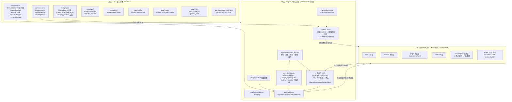

# Evergreen 上中下插件架构图（Dart 冷/热插件）

> 基于 `evg-base` 代码实况绘制：
> 上游 `lib/core/`（Core 内核）→ 中游 `plugins/`（manifest 声明 + 冷/热加载）→ 下游 `lib/renderer/`（渲染/HTML 输出）。

## Mermaid 图

## 层说明

### 上流 · Core（lib/core/）

| 模块 | 职责 |
| --- | --- |
| `core/module/` | **模块声明系统**：`ModuleDescriptor` V2 树（模块→页面→布局→插槽→组件）、`ModuleRegistry`、`ModuleLoader`、`ModuleLifecycle`、`ProcessManager` |
| `core/plugin/` | **插件执行抽象**：`PluginRunner`（`runOnce` / `startLong`）；桌面 `SubprocessRunner`、安卓 `ChaquopyRunner` |
| `core/services/` | `PluginInstaller`（.plugin 下载/签名/解压）、`UpdateService`、`CoreHttpServer`、OCR 管线 |
| `core/data/` | 数据编排：`DataOrchestrator`、`Provider`、缓存、Diff |
| `core/agent/` | Agent 运行时：Agent、Tools、Memory、Skills、Sessions |
| `core/config/` | 配置、设置、权限、数据源 |
| `core/theme/` | 主题声明、加载、渲染规则 |
| `core/utils/` | 沙箱路径、GreenixPath、Python 环境探测等 |
| 装配 | `lib/evergreen_base.dart`（barrel）、`app_bootstrap.dart`、`providers.dart`、`generated/plugin_imports.g.dart` |

### 中流 · Plugins 声明（manifest.json 驱动）

- **声明格式**：`plugins/<id>/module/manifest.json`，`type` 为 `module`；内置模块与外部插件同一格式。
- **冷插件（Cold）**：编译期静态导入（`plugin_imports.g.dart`）+ 启动时 `scanAndLoadModules(plugins/)` 批量注册并 `seal()`；随宿主构建发布。
- **热插件（Hot）**：运行时 `PluginInstaller.install()` 下载 `.plugin`（ZIP）→ SHA-256 签名校验 → 解压至 `plugins/<id>/` → `ModuleRegistry.reloadModule()` 热重载；`ModuleLifecycle` 支持 install/uninstall/disable/enable/upgrade。
- **后端进程**：`ProcessDescriptor` 声明 `.exe`/`.py`，`ModuleLoader` 启动子进程后通过 stdout 的 `PORT:<port>` 行发现端口并做 `/health` 检查。

### 下流 · Renderer / HTML（lib/renderer/）

- 五层渲染架构：`app/` → `module/` → `page/` → `slot/` → `components/`。
- 组件层：43 具名组件 + 20 占位组件，按 7 功能域分组（shared/document/data/interaction/creative/learning/controls）。
- 输出：HTML 页面（`docs/index.html`、插件 `render_log.html`）、Dart 渲染产物（`r12_dart_render.png`）。

## 关键文件索引

- `lib/evergreen_base.dart` — 双轨架构总出口
- `lib/core/module/module_descriptor.dart` — V2 声明树（2860 行）
- `lib/core/module/module_registry.dart` — 注册/seal/search/reloadModule/unregister
- `lib/core/module/module_loader.dart` — manifest 扫描 + 后端进程生命周期
- `lib/core/module/module_lifecycle.dart` — 安装/卸载/禁用/启用/升级
- `lib/core/plugin/plugin_runner.dart` — 执行抽象（桌面/安卓）
- `lib/core/services/plugin_installer.dart` — .plugin 安装
- `lib/core/docs/plugin-format.md` — .plugin ZIP 格式 + SHA-256 签名规范
- `lib/generated/plugin_imports.g.dart` — 冷插件静态导入
- `lib/renderer/renderer.dart` — 五层渲染 barrel
- `plugins/` — 13 个实际插件（ai-assistant / data-dashboard / dsh / html-creator / marketplace / pdf_translate / python-runner / scraper / settings / skill-creator / theme-creator / view / warm_study）
