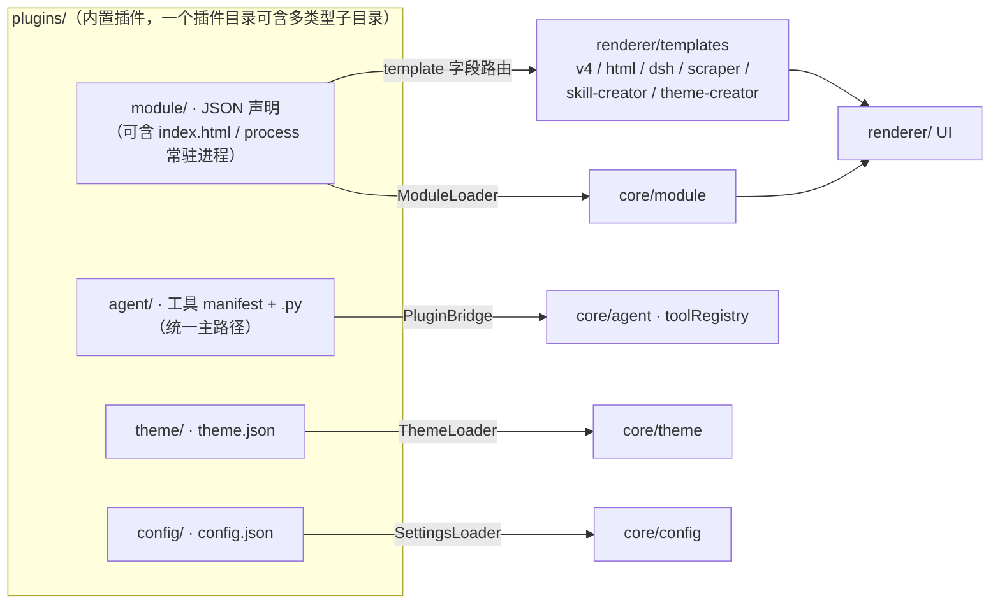

# Evergreen 内置插件目录

> 本目录是平台内置插件仓库。插件可以是：
> - **HTML 插件（用户侧主路径）**：`plugins/<name>/module/index.html` + `manifest.json`（`"template":"html"`），由 `html-creator` 创作/导出
> - **Dart/JSON 模块插件**：`plugins/<name>/module/manifest.json`，由 `ModuleLoader` 加载
> - **Agent 工具插件**：`plugins/<name>/agent/manifest.json` + `.py` 入口（统一主路径，`runtime:"python"`；`.exe` 仅存量 legacy），由 `PluginBridge` 发现
> - **主题插件**：`plugins/<name>/theme/theme.json`，由 `ThemeLoader` 加载
> - **配置插件**：`plugins/<name>/config/config.json`，由 `SettingsLoader` 加载
> - **常驻进程**：`plugins/<name>/module/manifest.json` 的 `process` 字段声明长驻 worker，由模块页经 `platform.process` 拉起



## 内置插件清单

| 插件 | 类型 | 说明 |
|------|------|------|
| `ai-assistant` | module | AI 助手：全功能聊天、工具调用、多会话、工作区 |
| `data-dashboard` | module | 数据中枢：数据源状态总览、连通性、一键拉取 |
| `dsh` | module | DeepSeek Harness：平台级常驻 Agent Web UI |
| `html-creator` | module | **HTML 插件创作中心**：三栏 IDE + 预览 + AI 辅助生成 + 导出 |
| `marketplace` | module | 插件市场：浏览、搜索、启用/停用、卸载 |
| `python-runner` | agent | Python 运行器：Agent 可调用的本地 Python 3.10 环境（**内置 Dart 工具** `PythonRunnerTool`，本目录 manifest 为声明镜像，含 `runtime:"python"`，无独立入口文件） |
| `scraper` | module | 所见即所得爬虫：抓包 + AI 生成 Python 爬虫 |
| `settings` | module + config | 设置面板：API Key、模型、主题等全局配置（v4 Dart 设置页；遗留 exe 形态已清理） |
| `skill-creator` | module | Skill 创作中心：多 Agent 流水线生成/导出 Skill |
| `theme-creator` | module | 主题创作中心：8 色语义色板可视化编辑 + 导出 |
| `vision` | agent + config | **多模态视觉工具**（Task R3-5）：Agent 工具 `vision`（stdin JSON，mode=ocr 提取图片/PDF/PPT 文字 / describe 读图描述 / generate 生图占位），OpenAI 兼容 chat/completions API；同包 `config/config.json` 提供 6 个设置项（OCR_API_* / VISION_API_*），由 `_stepSettings` 扫描自动注册进设置面板 |

> **模板路由**：`dsh`、`html-creator`、`scraper`、`skill-creator`、`theme-creator`
> 的 manifest 带 `template` 字段（依次为 `dsh` / `html` / `scraper` / `skill-creator` / `theme-creator`），
> 走专用模板渲染；其余内置模块走 v4 组件式渲染。新增内置插件后请同步登记本清单。

> **插件清单口径**：本目录 11 个内置插件 + `view` / `warm_study` / `zju_autosign` 3 个
> registry 托管插件（见下）= 全平台 **14 个插件身份**。
>
> **2026-08-25（t19）**：`pdf_translate` 内置插件已移除（PDF 翻译功能撤销，用户决定无内置
> 必要；渲染层 `translate` 组件与 core 翻译服务由对应 OWNER 同步下线，`pdf2zh_next` 引擎
> 与 `pdf_reader.py` 因论文阅读依赖**保留**）。

> **已移交 registry 的插件**：`view`（我的成绩单）、`warm_study`（温暖学习主题）、`zju_autosign`（学在浙大自动签到）
> 已移出内置插件目录，改由独立视图「发现插件」（`/discover`）经 `docs/plugin-registry/plugins.json` 管理（local 资源条目），
> 安装后经 `_copyLocalAssets` 落盘到 `plugins/<id>/`。

## HTML 插件（用户侧主路径）

用户通过 **HTML 创作中心**（`html-creator`）编写 HTML/CSS/JS，不需要写 Dart，也不需要完整理解 JSON 模块声明。

```
plugins/<name>/
└── module/
    ├── manifest.json    ← 由创作中心导出，template 为 "html"
    └── index.html       ← 用户自写 HTML/JS，可附带 css/js 等资源
```

导出为**单目标**写入运行期插件根 `{resolvePluginsRoot()}/{id}/module/`（与主题插件
`plugins/<id>/theme/theme.json` 同根，安卓/桌面行为一致）；`assets/plugins_bundle/` 是
`plugins/` 的纯镜像，仅由 `tool/bundle_plugins.dart` 生成，创作中心不直写。

## Agent 工具插件（开发者模式）

Agent 工具插件是**纯 Python 脚本（统一主路径）**，Agent 调用时启动进程，通过 stdin 或
命令行参数接收 JSON，stdout 返回结果。`.exe` 仅作存量 legacy 兼容（新插件一律 `.py`）。

```
plugins/<name>/
└── agent/
    ├── manifest.json    ← 工具描述 + JSON Schema + 参数模式 + runtime
    └── <name>.py        ← Python 脚本（纯标准库优先，跨平台/安卓 Chaquopy 同一份）
```

### manifest.json 模板

```json
{
  "name": "my_tool",
  "description": "工具描述（供 LLM 理解用途）。",
  "schema": { "type": "object", "properties": { ... }, "required": [...] },
  "readOnly": true,
  "runtime": "python",
  "argMode": "args",
  "argSpec": { "style": "flag", "prefix": "--" }
}
```

> `runtime` 必写：`"python"`（统一主路径）或 `"native"`（仅存量 legacy `.exe`）。
> PluginBridge 发现入口时 **`.py` 优先**（同名 `<目录名>.py` 最高优先）；仅当无任何 `.py`
> 且 manifest 未声明 `"runtime":"python"` 时才回退 `.exe`。声明 `"runtime":"python"`
> 却只提供 `.exe` 属错配，插件会被跳过。

### 参数模式

| argMode | PluginBridge 行为 |
|---------|-------------------|
| `stdin` | JSON 写入进程 stdin |
| `args` | 根据 argSpec 构造命令行参数 |
| (argSpec.style=flag) | `--key value` |
| (argSpec.style=positional) | 按 order 顺序输出 value |
| (argSpec.style=json) | `--args=<json>` |

### 编译（仅 legacy）

```bash
# legacy：.py → .exe（PyInstaller）。新插件不需要——.py 由平台解释器直接运行。
pyinstaller --onefile --console --distpath plugins/<name>/agent plugin.py
mv plugins/<name>/agent/plugin.exe plugins/<name>/agent/<name>.exe
```

## 主题插件

```
plugins/<name>/theme/theme.json
```

扁平 8 色语义色板（`background/surface/border/text/textSecondary/accent/error/others`），详见 `lib/core/theme/README.md`。

## 资产打包（Android）

内置插件通过 `tool/bundle_plugins.dart` 复制到 `assets/plugins_bundle/` 随 APK 发布（跳过 `.exe`、Python 缓存、
点文件、渲染日志等非功能资源），安卓端启动期由 `lib/core/utils/plugin_asset_releaser.dart` 释放到设备可写目录。
**修改 `plugins/` 下运行时脚本（.py 等）后必须重跑 `bundle_plugins.dart`**，否则 APK 打包旧文件。

## 数据源插件（开发者模式）

```
plugins/<name>/data/
├── manifest.json          ← 数据源清单（type: "data-source"）
└── fetch.py               ← CLI 一次性脚本（模型 A，推荐；或模型 B HTTP 长驻 legacy）
```

数据源插件让平台新增可拉取的数据类型（模型 A：每次拉取执行一次脚本，stdout 顶层 JSON Map；
模型 B legacy：HTTP 长驻服务 + `PORT:` 探测）。manifest 契约、`auth`/`stream`/`file`/`process`
可选声明字段、脚本 stdout 契约见 `lib/core/data/docs/plugin-data-source.md` 与
`lib/core/data/docs/plugin-authoring-guide-data.md`（第九节含 `evg_lib` 可选导入与流式声明示例）。

> 本内置插件目录当前无 `data/` 数据源插件；可运行示例与「声明 + 契约」样板见
> `lib/core/data/example/plugins/douban/`（模型 A CLI 爬虫）与
> `docs/plugin-registry/examples/example-data-video_stream/`（带登录 + 视频流式声明）。
