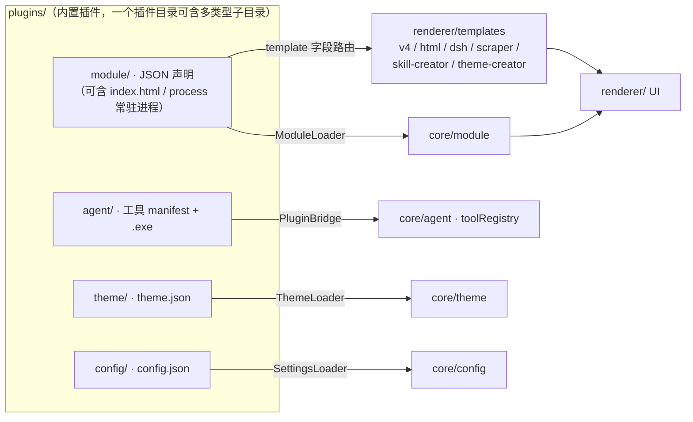

# Evergreen 内置插件目录

> 本目录是平台内置插件仓库。插件可以是：
> - **HTML 插件（用户侧主路径）**：`plugins/<name>/module/index.html` + `manifest.json`（`"template":"html"`），由 `html-creator` 创作/导出
> - **Dart/JSON 模块插件**：`plugins/<name>/module/manifest.json`，由 `ModuleLoader` 加载
> - **Agent 工具插件**：`plugins/<name>/agent/manifest.json` + 可执行文件，由 `PluginBridge` 发现
> - **主题插件**：`plugins/<name>/theme/theme.json`，由 `ThemeLoader` 加载
> - **配置插件**：`plugins/<name>/config/config.json`，由 `SettingsLoader` 加载
> - **常驻进程**：`plugins/<name>/module/manifest.json` 的 `process` 字段声明长驻 worker，由模块页经 `platform.process` 拉起



## 内置插件清单

| 插件 | 类型 | 说明 |
|------|------|------|
| `ai-assistant` | module | AI 助手：全功能聊天、工具调用、多会话、工作区 |
| `data-dashboard` | module | 数据中枢：数据源状态总览、连通性、一键拉取 |
| `dsh` | module | DeepSeek Harness：平台级常驻 Agent Web UI |
| `html-creator` | module | **HTML 插件创作中心**：三栏 IDE + 预览 + AI 辅助生成 + 导出 |
| `marketplace` | module | 插件市场：浏览、搜索、启用/停用、卸载 |
| `pdf_translate` | module | PDF 翻译：DeepSeek 驱动、7 语言互译、双语对照 PDF |
| `python-runner` | agent | Python 运行器：Agent 可调用的本地 Python 3.10 环境 |
| `scraper` | module | 所见即所得爬虫：抓包 + AI 生成 Python 爬虫 |
| `settings` | module + config | 设置面板：API Key、模型、主题、HTTP 设置页面 |
| `skill-creator` | module | Skill 创作中心：多 Agent 流水线生成/导出 Skill |
| `theme-creator` | module | 主题创作中心：8 色语义色板可视化编辑 + 导出 |

> **模板路由**：`dsh`、`html-creator`、`scraper`、`skill-creator`、`theme-creator`
> 的 manifest 带 `template` 字段（依次为 `dsh` / `html` / `scraper` / `skill-creator` / `theme-creator`），
> 走专用模板渲染；其余内置模块走 v4 组件式渲染。新增内置插件后请同步登记本清单。

> **已移交 registry 的插件**：`view`（我的成绩单）、`warm_study`（温暖学习主题）、`zju_autosign`（学在浙大自动签到）
> 已移出内置插件目录，改由「发现插件」页经 `docs/plugin-registry/plugins.json` 管理（local 资源条目），
> 安装后经 `_copyLocalAssets` 落盘到 `plugins/<id>/`。

## HTML 插件（用户侧主路径）

用户通过 **HTML 创作中心**（`html-creator`）编写 HTML/CSS/JS，不需要写 Dart，也不需要完整理解 JSON 模块声明。

```
plugins/<name>/
└── module/
    ├── manifest.json    ← 由创作中心导出，template 为 "html"
    └── index.html       ← 用户自写 HTML/JS，可附带 css/js 等资源
```

导出时平台同时写入运行期 `plugins/` 与内置资产目录，确保开发/运行一致。

## Agent 工具插件（开发者模式）

Agent 工具插件是任意可执行文件，Agent 调用时启动进程，通过 stdin 或命令行参数接收 JSON，stdout 返回结果。

```
plugins/<name>/
└── agent/
    ├── manifest.json    ← 工具描述 + JSON Schema + 参数模式
    ├── plugin.py        ← Python 源码（可选）
    └── <name>.exe       ← PyInstaller --onefile 编译产物
```

### manifest.json 模板

```json
{
  "name": "my_tool",
  "description": "工具描述（供 LLM 理解用途）。",
  "schema": { "type": "object", "properties": { ... }, "required": [...] },
  "readOnly": true,
  "argMode": "args",
  "argSpec": { "style": "flag", "prefix": "--" }
}
```

### 参数模式

| argMode | PluginBridge 行为 |
|---------|-------------------|
| `stdin` | JSON 写入进程 stdin |
| `args` | 根据 argSpec 构造命令行参数 |
| (argSpec.style=flag) | `--key value` |
| (argSpec.style=positional) | 按 order 顺序输出 value |
| (argSpec.style=json) | `--args=<json>` |

### 编译

```bash
pyinstaller --onefile --console --distpath plugins/<name>/agent plugin.py
mv plugins/<name>/agent/plugin.exe plugins/<name>/agent/<name>.exe
```

## 主题插件

```
plugins/<name>/theme/theme.json
```

扁平 8 色语义色板（`background/surface/border/text/textSecondary/accent/error/others`），详见 `lib/core/theme/README.md`。

## 资产打包（Android）

内置插件通过 `tool/bundle_plugins.dart` 复制到 `assets/plugins_bundle/` 随 APK 发布（跳过 `.exe`、Python 缓存、
点文件、渲染日志等非功能资源），安卓端启动期由 `lib/core/utils/plugin_asset_releaser.dart` 释放到设备可写目录。
**修改 `plugins/` 下运行时脚本（.py 等）后必须重跑 `bundle_plugins.dart`**，否则 APK 打包旧文件。
