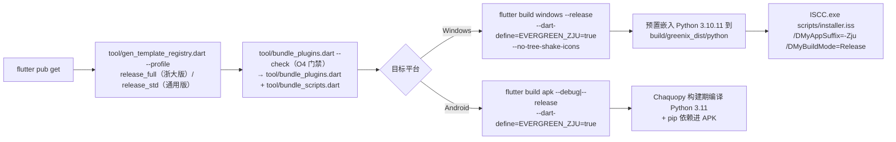

# Scripts

Python 管线（OCR / PDF 翻译）、嵌入式运行时、安装包配置。

> 这些脚本属于平台/开发者管线（OCR、PDF 翻译、打包）。普通用户 HTML 插件不直接调用，
> 如需 OCR/PDF 能力请通过平台 `platform.api.call` 或内置模块使用。

## 文件

| 文件 | 说明 |
|------|------|
| `ocr_file.py` | 本地文件 OCR（Tesseract），输出 JSON |
| `ocr_slides.py` | 课件 URL 批量 OCR（下载→识别），输出 JSON 数组 |
| `pdf_to_images.py` | PDF 转 JPEG 图片列表 |
| `paper_reader.py` | PDF 文本提取 + 文本级翻译 CLI（复用 `pdf2zh_next` 引擎，stdin/stdout JSON Lines 协议） |
| `paper_vision.py` | Paper Vision V3 极简文本管线：OCR → 分章节 → 段落+过渡语 → 段落翻译（DeepSeek-OCR + DeepSeek LLM） |
| `pdf_translate.py` | PDF 翻译（babeldoc 排版 + `pdf2zh_next` 引擎），stdout JSON Lines 进度协议 |
| `pdf_translate_pure.py` | 纯 Python PDF 翻译（安卓专用：pdfminer.six 读布局 + `pdf2zh_next` 引擎 + reportlab 写双语 PDF），协议与 `pdf_translate.py` 兼容 |
| `verify_pipeline.py` | 用 `.greenix/config.json` 的真实 Key 验证 `paper_vision` 管线 |
| `requirements.txt` | OCR 基础依赖（pytesseract / Pillow / requests / pdf2image）；PDF 翻译依赖随嵌入式 Python 预装 |
| `setup_python.cmd` | 下载嵌入式 Python 3.10.11（embeddable）+ 启用 pip + 安装 `requirements.txt` |
| `reload.cmd` | 重新编译辅助：`flutter pub get` + `flutter build windows --release` |
| `installer.iss` | Inno Setup 安装包脚本（双版 × 双模式，CI 传参区分） |
| `installer_platform.iss` | 平台参数（include，遗留文件，CI 未引用） |
| `test_paper_vision.py` | `paper_vision` 全覆盖测试（不依赖 API Key / PDF / 网络） |
| `test_pomodoro.py` | `pomodoro.exe` 模块 server 冒烟测试 |

## 目录

| 目录 | 说明 |
|------|------|
| `pdf2zh_next/` | PDF 翻译引擎（桌面 + 安卓复用，DeepSeek→OpenAI 兼容翻译器） |

## 构建 / 打包



### Windows 安装包（CI：`.github/workflows/release.yml`）

```bash
# 1. 生成模板注册表（profile 二选一）+ bundle --check 门禁 + 插件/脚本资产
dart run tool/gen_template_registry.dart --profile release_full   # 浙大专用版；通用版用 release_std
dart run tool/bundle_plugins.dart --check   # O4 门禁：校验提交态一致性（pubspec 标记块 + 本地镜像），不一致退出非 0
dart run tool/bundle_plugins.dart
dart run tool/bundle_scripts.dart

# 2. 构建 Flutter（双版由 EVERGREEN_ZJU 区分；release 需 --no-tree-shake-icons）
flutter build windows --release --dart-define=EVERGREEN_ZJU=true --no-tree-shake-icons

# 3. 预置嵌入式 Python（installer 打包进 {app}\.greenix\python）
#    build\greenix_dist\python\ = Python 3.10.11 embeddable + pip install -r scripts/requirements.txt

# 4. 打包安装程序（需安装 Inno Setup 6+）
ISCC.exe scripts\installer.iss "/DMyAppName=Evergreen" "/DMyAppSuffix=-Zju" "/DMyBuildMode=Release"
# 双版：-Zju（浙大专用版）/ -Std（通用版）；双模式：Release / Debug
# 输出: build\installer\EvergreenSetup{Zju|Std}-{Release|Debug}-<ver>.exe
```

### Android APK

```bash
# 1. 生成模板注册表 + bundle --check 门禁 + 插件/脚本资产（同 Windows 步骤 1）
# 2. 构建 APK（Chaquopy 在构建期把 Python 3.11 与 pip 依赖编译进 APK）
flutter build apk --debug --dart-define=EVERGREEN_ZJU=true
# 注意：buildPython 缺失时 chaquopy 会静默跳过 src/main/python 打包，
# 请确保本机有 Python 3.11 或设置 CHAQUOPY_BUILD_PYTHON（见 android/app/build.gradle.kts）。
```

## 规则

- 嵌入式 Python 已自带，用户无需安装 Python。
- **`assets/plugins_bundle/` 是 `plugins/` 的纯镜像不变式**：仅由 `tool/bundle_plugins.dart` 生成；运行期代码（renderer 导出等）禁止直写 bundle。校验用 `dart run tool/bundle_plugins.dart --check`（O4 门禁，CI 构建前执行；`assets/plugins_bundle/` 被 .gitignore，CI 首建场景只校验 pubspec 提交态）。修复漂移：重跑 `bundle_plugins.dart` 并把 pubspec.yaml 变更一并提交。
- 排除规则含任意层级的 `AGENT.md`（OWNER 职责书，非运行期资源）、顶层 `README.md`、`.exe`、点文件、Python 缓存等（详见 `tool/bundle_plugins.dart` 的 `_shouldSkip`）。
- Windows：OCR / PDF 翻译依赖由 `setup_python.cmd` 预装到嵌入式 Python；Android：依赖由 Chaquopy 构建期安装（`android/app/build.gradle.kts` 的 `chaquopy.pip` 声明）。
- 修改 `plugins/` 或 `scripts/` 资产后必须重跑 `tool/bundle_plugins.dart` / `tool/bundle_scripts.dart`，否则 APK / 安装包打入旧文件。
- `pubspec.yaml` 资产声明分两类：`assets/plugins_bundle/`、`assets/scripts_bundle/` 由上述工具写入各自标记块（`>>>PLUGIN_ASSETS_START>>>` / `>>>SCRIPTS_ASSETS_START>>>`，重跑即整体重写）；`docs/plugin-registry/`（registry 清单 + `assets/` 本地资源）为手写声明，须保持标记块外、逐文件显式声明（目录声明不递归子目录），勿放入自动生成块。
- 用户数据（`.env`、`.cookies` 等）在运行时生成于 `.greenix/`，不在打包产物内。
