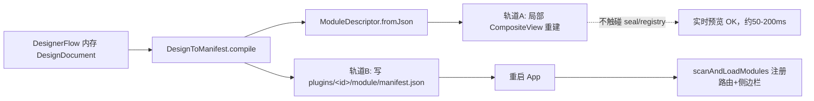

# 全流程插件创作流 — 清洁版技术方案（重写 v2.0）

> **版本**: 2.0（重写） | **创建**: 2026-07-11 | **状态**: 待评审
> **重写说明**: 本文档基于 `d:\evg-workplace\evg-base\`（副本目录）代码库的逐文件核对结果，对原 v1.0 规划进行重写。修正了**路径错误、虚构前提、串码乱码、失准的数据契约与过度承诺指标**，并将三大复杂问题（seal 热加载冲突、DesignDocument 从零建模、文档失准）单列章节细化解法。

---

## 一、项目概述

**一句话定位**：在 Evergreen 平台上构建「所见即所得爬虫 → 配置自动推断 → PPT 式可视化编排 → 预览/发布」的插件 GUI 创作流，将插件开发从"写 JSON + 编译 .exe"降到"框选网页 + 拖放组件"的半自动流程。

**核心价值**：通过 GUI 完成插件全生命周期管理（采集、配置、编排、预览、上架），降低重复劳动，复用现有 ScraperFlow 与 Agent Runtime（DeepSeek 驱动）。

**项目范围（务实版）**：
- **复用**：`lib/renderer/components/document/scraper/`（12 个文件，爬虫基础已存在）、`ModuleLoader` / `ModuleRegistry` / `CompositeView` / `DataOrchestrator` / `ConfigHttpServer` / Agent Runtime（均已存在，扩展而非重写）。
- **新建**：`plugin-designer/` 编排器（约 8 个文件，从零）、`DesignDocument` 模型与 `DesignToManifest` 编译器。
- **少量扩展**：`scraper_exporter.dart` 补齐 data manifest 生成；`config_register.dart`、`data_pluginer.dart` 新增。

**代码量估算**：约 2,800–3,500 行新增（含测试），**低于**原稿虚报的 3,380 行覆盖"三大模块"的口径——因为 DesignerFlow 实为新建而非"基于现有"。

---

## 二、架构设计

### 2.1 分层架构（落点已修正）

```
用户交互层（lib/renderer/components/）
┌──────────────────────────────────────────────────────────────┐
│  ScraperGeneratorView    PluginDesignerView     PreviewPanel  │
│  （scraper/ 已存在）     （plugin-designer/ NEW）  （plugin-designer/widgets）│
└──────────┬────────────────────┬─────────────────────┬────────┘
           │                    │                     │
编排服务层（归入 lib/core/*，非 lib/renderer/services）
┌──────────┼────────────────────┼─────────────────────┼────────┐
│  DataPluginer    ConfigRegister    DesignToManifest   PluginPreloader │
│  (core/data NEW)  (core/config NEW)  (plugin-designer/)  (core/module 可选)│
└──────────┼────────────────────┼─────────────────────┼────────┘
           │                    │                     │
基础设施层（均已存在，扩展而非重写）
┌──────────┼────────────────────┼─────────────────────┼────────┐
│  DataOrchestrator   ConfigHttpServer   ModuleLoader   ModuleRegistry │
│  AgentRuntime(DeepSeek)   ProcessManager   python-runner(mode=run)   │
└─────────────────────────────────────────────────────────────────────┘
```

### 2.2 模块划分（目录已对齐真实代码库）

| 模块 | 真实目录 | 职责 | 关键技术依赖 |
|------|---------|------|-------------|
| **ScraperFlow** | `components/document/scraper/`（已存在）| WebView2 CDP 抓包 → 解析 → 生成 Python 爬虫 | `webview_windows` + CDP 9222；`ScraperWorkflow` 状态机已存在 |
| **DataPluginer** | `core/data/data_pluginer.dart`（NEW）| 爬虫输出包装为标准 data-source 插件 | `DataOrchestrator`、`DataType` |
| **ConfigRegister** | `core/config/config_register.dart`（NEW）| data 插件字段 → 自动生成 config.json | `ConfigHttpServer`（9 端点 + `_dynamicSettings`）|
| **DesignerFlow** | `components/document/plugin-designer/`（NEW）| PPT 式 Page/Slot/Component 可视化编排 | 自建 `DesignDocument` 模型；`CompositeView` 复用 |
| **DesignToManifest** | `plugin-designer/services/`（NEW）| DesignDocument → manifest.json（schemaVersion 2.0）| `ModuleDescriptor.fromJson` |
| **PluginPreloader** | `core/module/plugin_preloader.dart`（可选 NEW）| 文件落盘监控 → 触发重启/预览同步 | `watcher`（可选）|
| **Python 直跑迭代** | `plugins/python-runner`（已存在）| 开发期直接 `mode=run` 执行 .py，跳过 PyInstaller | `python-runner` agent |

### 2.3 依赖关系

```
ScraperFlow ──→ DataPluginer ──→ ConfigRegister
                                     │
DesignerFlow ──→ DesignToManifest ───┤
                                     ▼
                          PluginPreloader（可选文件监控）
                                     │
                    ┌────────────────┴─────────────────┐
              轨道A: 内存 CompositeView 预览      轨道B: 写盘+重启注册
              （不触碰 seal/registry）          （scanAndLoadModules 注册路由）
```

依赖注入沿用现有 `lib/providers.dart` 的 Riverpod Provider（`moduleRegistryProvider`、`dataOrchestratorProvider`、`pluginsDirProvider` 等），新增 `pluginDesignerProvider`（持有当前 `DesignDocument`）与可选 `pluginRegistryProvider`（发布态插件路由合并，见 §6.1）。

---

## 三、技术选型（已逐项核实 pubspec.yaml）

| 技术 | 版本 | 状态 | 备注 |
|------|------|------|------|
| Dart SDK | ^3.9.2 | 已声明 | `pubspec.yaml:7` |
| Flutter | 3.35.7 (stable) | 已锁定 | |
| `flutter_riverpod` | ^2.6.1 | 已声明 | 全局 DI + 响应式 |
| `go_router` | ^14.8.1 | 已声明 | 路由（启动时一次性构建，见 §6.1）|
| `dio` | ^5.9.2 | 已声明 | HTTP 通信 |
| `webview_windows` | ^0.4.0 | 已声明 | CDP 9222 抓包（scraper 已用）|
| `webview_flutter` | ^4.10.0 | 已声明 | HTML 内嵌 |
| `shared_preferences` | ^2.3.0 | 已声明 | 设置持久化 |
| `re_editor` | ^0.10.0 | 已声明 | 代码编辑器 |
| `diff_match_patch` | ^0.4.1 | 已声明 | 版本对比 |
| `flutter_markdown` / `flutter_highlight` | ^0.7.6 / ^0.7.0 | 已声明 | 渲染 |
| Python | >= 3.10 | 环境 | `python-runner` 直接执行 |
| PyInstaller | ^6.x | 环境 | **仅"上架"按钮异步编译 .exe** |

**新增/调整依赖**：
- `watcher`（Dart pub，**真实存在**）：**可选**，仅用于"文件落盘后自动触发发布预览"。预览主链路走内存重建，不依赖它。
- ~~`pathspec`~~：**删除**。Dart pub 无此包；路径过滤改用 `package:glob`（已在 `pubspec` 生态）或自定义 glob 字符串匹配。

---

## 四、核心模块（含真实集成契约）

### 4.1 ScraperFlow — 所见即所得数据采集（基础已存在）

**现状**：`scraper/` 已含 `ScraperWorkflow`（纯 Dart 状态机）、`scraper_exporter`（**是 `library scraper_exporter`，非类**，含锁定 config 模板 `scraperConfigTemplate`，AI 不可改逻辑）、`CdpNetworkClient`、`ScraperGeneratorView`、`ScraperAiPanel` 等 12 个文件。

**职责**：内嵌浏览器标选目标数据 → 自动生成 Python 爬虫 + 注册 data 插件。

> ⚠️ **接口分现状 / 待新增两栏**。以下按代码逐行核对，凡本库不存在者一律标注 `NEW`，杜绝把待建封装写成既有能力。

**(A) 现状真实接口（`scraper_workflow.dart` 已存在，逐行核对属实）**：

```dart
// 纯 Dart 状态机，无 Flutter 依赖，通过 onChanged/listeners 通知 UI
class ScraperWorkflow {
  ScraperPhase get phase;                    // idle→capturing→analyzing→questioning→generating→running→debugging→done→failed
  List<HttpRequestLog> get logs;             // ⚠ 是 logs（只读，源自私有 _logs），无 capturedRequests 字段
  bool get hasLogs;  int get debugCount;  int get debugRemaining;

  // 阶段推进（全为同步 void，非 Future）：
  void startCapturing();   void startAnalyzing();  void startQuestioning();
  void startGenerating();  void startRunning();    void startDebugging(); // 内建 5 轮上限
  void markDone();         void markFailed(String reason);   void reset();

  void addLog(HttpRequestLog log);   void addLogs(List<HttpRequestLog> logs);
  void setPythonCode(String code);   void setPythonOutput(String output);
  String requestLogsSummary();       // 供 Agent 分析的日志摘要
}
// 已存在模型：HttpRequestLog（timestamp/method/url/headers/body + fromJson/toJson/toAiSummary）
```

**(B) 待新增封装（`NEW`，本库搜索 0 命中，须在 P1 建）**：

```dart
// scraper_flow_facade.dart（NEW）—— 包住现有状态机 + Agent + exporter，对外提供高阶动作
class ScraperFlowFacade {
  Future<void> startCapture(String url);                 // NEW：CDP 9222 + Network.enable，内部 workflow.startCapturing()
  Future<InferredSchema> analyzeSelection(List<HttpRequestLog> selected); // NEW：Agent(DeepSeek) 推断字段；InferredSchema 亦为 NEW 模型
  Future<ExportResult> generateAsDataPlugin(InferredSchema schema);       // NEW：调 scraper_exporter.exportAsPython + 生成 data/manifest.json
}
```

> `InferredSchema`、`startCapture/analyzeSelection/generateAsDataPlugin` 均为 **P1 要新建的封装层**，现状代码里不存在。现状调 Agent 的编排在 `ScraperAiPanel` 中，新封装应复用而非重写。

**流程**：URL → `ScraperGeneratorView` 内嵌 `WebviewController`（CDP 9222）→ 注入 JS 拦截 `XMLHttpRequest`/`fetch` → 实时日志（`workflow.addLog`）→ 用户选中请求 → Agent(DeepSeek) 分析响应体推断字段 → 顶层函数 `exportAsPython(pythonCode, outputDir)` 生成 `scraper.py`（`lxml` 解析 + 强制注入 `scraperConfigTemplate`）→ 新增逻辑补写 `data/manifest.json` → 写入 `plugins/<name>/data/`。

**实现位置**：**扩展 `scraper_exporter` 库**（现仅 `exportAsPython`/`exportAsExe` 两个顶层函数 + `ExportResult`/`scraperConfigTemplate`），**新增** manifest 生成函数（补 `dataTypes[]` 字段，对齐 §4.2）；`generateAsDataPlugin` 作为封装层调用它。

### 4.2 DataPluginer — 数据插件自动注册（真实契约）

> ⚠️ 原 v1.0 的 data-source manifest 契约（`endpoint`/`refreshInterval`/`process`）**与代码不符**，以本节约定的真实契约为准。

**真实契约**（核实自 `main.dart:102` `_scanAndRegisterDataSources`）：

```json
{
  "type": "data-source",
  "script": "fetcher.exe",
  "dataTypes": [
    {
      "name": "weather",
      "typeArg": "weather",
      "ttl": "5m",
      "persistentKey": "myplugin:weather",
      "category": "天气",
      "displayName": "天气数据"
    }
  ]
}
```

**关键事实**：
- 扫描逻辑 `main.dart:102` 在模块加载**前**调用，避免渲染时数据源未注册的时序问题。
- `script` 路径**相对 `data/` 目录**；`DataOrchestrator.register(type, fetcher)` 的 fetcher 以 `Process.run(exe, ['--type', typeArg, '--project-root', root])` 运行，期望 **stdout 输出 JSON**。
- `DataType` 字段：`name` / **`typeArg`（必填，`main.dart:133` 实测作为 CLI `--type` 参数传入 fetcher）** / `category` / `displayName` / `ttl`（`^\d+(s|m|h)$`）/ `persistentKey`。
- `DataPluginer` 产出物 = 上述 `data/manifest.json` + 由 `ScraperExporter` 生成的 `fetcher.exe`（开发期先用 `python-runner` 直跑 .py）。

### 4.3 ConfigRegister — 配置自动注册（端点已核实）

**真实端点**（`config_http_server.dart:6`，与 v1.0 描述一致，保留）：`GET /config/health`、`GET /config/settings`、`GET /config/settings/:key`、`POST /config/settings`、`POST /config/settings/:key`、`GET /config/permissions/:id`、`POST /config/permissions/:id`、`GET /config/sources`、`POST /config/sources`。

**关键能力**：`ConfigHttpServer.registerSetting(key, label)` 支持**运行时动态注入**未声明的配置项（`_dynamicSettings` 映射），供 data 插件新增的凭证类字段使用。

**职责**：从 data 插件的 manifest + `.py` 源码提取请求参数（URL/headers/cookies）→ 输出字段列表与刷新策略 → 生成 `plugins/<name>/config/config.json`。

> ⚠️ **禁止复用 `initSettings()` 做运行时注入**。`core/config/CLAUDE.md` 明确：`initSettings()` 只在 `main()` 调用一次，**重复调用会清空重建 `_decls`**，破坏既有设置。运行期新增 data 插件的凭证类字段，**必须走 `ConfigHttpServer.registerSetting(key, label)` 动态注入路径**（写入 `_dynamicSettings`，不触碰 `_decls`），再由 `.py` 端 `_get_config(key)` 经 HTTP 读取。

### 4.4 DesignerFlow — PPT 式编排编辑器（**从零新建，非"基于现有"**）

> ⚠️ 原 v1.0 声称"基于现有 `modules/design_document.dart`"——**不存在**。本模块全部为 NEW，模型定义见 §6.2。

**编排模型**（自建 `DesignDocument`）：

```
DesignDocument
  ├── metadata: { pluginId, pluginName, icon, route, description, version }
  ├── pages[]: DesignPage
  │     ├── id, label, layoutPreset (dock/grid/flex/fullscreen)
  │     └── slots[]: DesignSlot
  │           ├── id, region (top/left/center/right/bottom)
  │           ├── rect (画布矩形坐标 + 宽高，仅编辑器 UI 用)
  │           └── component: DesignComponent
  │                 ├── type ("data-table" | "chart" | "chat" | ... 共 65 种：45 具名类型 + 20 个 placeholder-01~20 预留位)
  │                 └── config (字段级属性 Map)
```

**四个编排阶段**：① Module 配置（写 metadata）→ ② 页面编排（pages[]，选布局范式）→ ③ Slot 框选（画布拖拽，SlotPainter 虚线框）→ ④ 组件绑定（ComponentPicker 拖入 + PropertyPanel 编辑）。产出完整 `DesignDocument`。

**实现位置**（全部 NEW）：
- `plugin_designer_view.dart`：三栏（组件面板 | 画布 | 属性）
- `models/design_document.dart`：模型 + 序列化
- `view/canvas_area.dart` + `view/slot_painter.dart`：框选 + 虚线框
- `view/component_picker.dart`：7 功能域分组 **65 种组件（45 具名 + 20 placeholder）**
- `view/property_panel.dart`：通用属性编辑
- `view/page_sorter.dart`：页面缩略图排序增删
- `services/design_to_manifest.dart`：doc → manifest 2.0（§6.2）

### 4.5 热加载预览（双轨，详见 §6.1）

- **轨道 A（实时预览）**：内存 `DesignDocument` → `DesignToManifest.compile` → `ModuleDescriptor.fromJson` → 局部 `CompositeView` 重建。**不触碰 `ModuleRegistry` / 路由**。
- **轨道 B（持久发布）**：写盘 `plugins/<id>/module/manifest.json` + `data/` + `config/`；侧边栏/路由注册需**重启一次**（诚实标注）。

---

## 五、数据流（核心场景）

```
用户操作                      系统动作                                数据变化
─────────────────────────────────────────────────────────────────────────────
① 打开爬虫输 URL   →  ScraperWorkflow 进入 capturing    CDP 抓取请求队列 []
                       WebView2 CDP Network.enable + JS 拦截
② 选中请求→AI分析  →  Agent(DeepSeek) 调 API 推断字段     推断 Schema JSON
③ 点击"生成插件"    →  ScraperExporter 生成 .py(lxml)
                       DataPluginer 生成 data/manifest.json
                       ConfigRegister 生成 config/config.json
                       写入 plugins/<name>/data/ + /config/         磁盘文件
④ (开发期)直跑迭代  →  python-runner mode=run 执行 .py     跳过 PyInstaller 编译
⑤ 切到 DesignerFlow →  读取 data 绑定 → 填充组件选项        DesignDocument 模型
   框选 Slot/拖组件
⑥ 点击"保存/预览"  →  轨道A: DesignToManifest → 内存 CompositeView 实时刷新
⑦ 点击"发布上架"    →  写盘 module/manifest.json
                       (可选) PyInstaller 异步编译 .exe + 进度
                       重启 App → scanAndLoadModules 注册路由        侧边栏出现
```

---

## 六、复杂问题细化解法（重点）

### 6.1 问题一：ModuleRegistry.seal() 与"实时热加载"冲突（最高风险）

**约束核实**（已读源码）：
- `ModuleRegistry.seal()`（`module_registry.dart:65`）后，`register()` 抛 `StateError`；`modules` / `buildRoutePaths()` / `navGroups` 全部 `_requireSealed()`（`:76/:179/:188`）。
- go_router 路由基于 `ModuleRegistry` 构建；registry 在 `main.dart` 启动流程的模块加载后被 `seal()`，运行期不可再 `register`，路由随之固定。
- `CompositeView`（`lib/renderer/page/composite_view.dart:102`）以 `descriptor` 为构造参数，**不监听** registry 变化。

**结论**：真正"热注册进路由/侧边栏"在现有架构下**不可行**（且触及稳定性红线，禁止重写 seal 核心）。

**双轨解法（不触碰 seal 核心）**：



- **轨道 A（实时预览，可行）**：`PreviewPanel` 内持有 `DesignDocument`；任一编辑后防抖 300ms → `DesignToManifest.compile(doc)` → `ModuleDescriptor.fromJson(map)` → 重建子树 `CompositeView(descriptor: descriptor)`（包 `AnimatedSwitcher` 消闪烁）。成本 = JSON 解析 + 子树 rebuild = O(slots)，典型插件 **50–200ms**。无 registry、无路由参与。
- **轨道 B（持久发布，诚实）**：写入 `plugins/<id>/module/manifest.json` + `data/` + `config/`；侧边栏/路由注册需**重启一次**。如需免重启，仅开放**单一扩展点**——go_router 通过一个读取 Riverpod `pluginRegistryProvider` 的 `StatefulShellRoute` 动态合并插件路由（一次性改动，非逐模块），列为可选增强。**注意：`StatefulShellRoute` 当前全库 0 命中，属需新建代码（`NEW`），非既有能力**；且它绕过 `seal()` 后的固定路由，须评估是否触及 §6.1 稳定性红线（见文末评审待办）。
- **Python 迭代解耦**：data 插件开发期用 `python-runner` 直接 `python scraper.py`（`mode=run`）运行，跳过 20s–2min 的 PyInstaller onefile 编译；仅"上架"按钮异步编译 `.exe` 并展示进度。

**性能目标（务实版）**：

| 变更类型 | 轨道 | 真实耗时 |
|---|---|---|
| 编排字段修改 | A 内存重建 | < 200ms |
| 新增/替换 Slot | A 内存重建 | < 200ms |
| 新组件类型 | A 内存重建（已注册类型）| < 200ms |
| .py 逻辑修改 | python-runner 直跑 | < 1s |
| 发布到侧边栏 | B 重启注册 | 重启一次（秒级启动）|

### 6.2 问题二：DesignDocument 从零建模 + DesignToManifest 映射

原稿声称"基于现有 design_document.dart"——**全库 0 文件**。须从零定义，且 `DesignToManifest` 输出**严格对齐已验证的** `plugins/showcase-v3/module/manifest.json` 结构。

**模型（接口级）**：

```dart
class DesignDocument {
  final DesignMetadata metadata;
  final List<DesignPage> pages;
  Map<String, dynamic> toJson();
  static DesignDocument fromJson(Map<String, dynamic> m);
}

class DesignMetadata {
  final String pluginId;     // 用于 route / 目录名
  final String pluginName;
  final String icon;         // material icon 名
  final String route;        // 如 /my-plugin
  final String description;
  final String version;
}

class DesignPage {
  final String id;
  final String label;
  final String layoutPreset; // dock | grid | flex | fullscreen
  final bool isDefault;      // 对应 manifest 的 default
  final bool hideTab;        // 对应 manifest 的 hideTab
  final List<DesignSlot> slots;
}

class DesignSlot {
  final String id;
  final String region;       // top/left/center/right/bottom
  final Rect rect;           // 画布坐标+宽高（仅编辑器 UI 用，不进 manifest）
  final DesignComponent component;
}

class DesignComponent {
  final String type;         // 具名组件 type 字符串（权威清单见下）
  final Map<String, dynamic> config;
}
```

> **组件类型权威源（务必对齐）**：`type` 字符串的唯一权威注册表是 `composite_view.dart:1157-1204` 的 `switch (config.type)`（`ai-assistant`/`chat`/`form`/`settings`/`data-dashboard`/`code-editor`/`prompt-builder`/`data-table`/`card-list`/`chart`/`stat-tile`/`kanban`/`tree`/`timeline`/`map`/`doc-viewer`/`doc-editor`/`document`/`video-player`/`video`/`audio-player`/`image-gallery`/`presentation`/`nav-button`/`button`/`timetable`/`markdown`/`spreadsheet`/`notepad`/`whiteboard`/`mindmap`/`diff-viewer`/`terminal`/`type-check`/`flashcards`/`quiz`/`crossword`/`pronunciation`/`custom`/`webview`/`divider`/`lottery-wheel`/`calendar`/`scraper-generator`/`tech-planner`，共 45 个具名 case，部分为别名指向同一 Widget；**加上 20 个 `placeholder-01~20` 预留位，全仓库共 65 种组件类型**）。**ComponentPicker 的可选组件清单必须从此 switch 派生**，不得凭 showcase-v3 文案臆造。
>
> **未注册类型兜底**：switch 的 `_ =>` 分支渲染 `UnknownSlot`（`placeholder-*` 前缀归"预留扩展"，其余归"未知"）。故 `DesignToManifest` 输出未注册 `type` 时预览不会崩溃，但会落到 UnknownSlot 占位——编辑器应在绑定阶段即校验 `type` 是否在权威清单内并提示。

**DesignToManifest.compile 映射（对齐 schemaVersion 2.0）**：

```dart
static Map<String, dynamic> compile(DesignDocument doc) {
  return {
    'schemaVersion': '2.0',
    'renderMode': 'dart',
    'type': 'module',
    'id': doc.metadata.pluginId,
    'name': doc.metadata.pluginName,
    'description': doc.metadata.description,
    'icon': doc.metadata.icon,
    'route': doc.metadata.route,
    'ui': 'composite',
    'version': doc.metadata.version,
    'dependencies': [],
    'nav': {'sidebar': {'section': '创作', 'sectionOrder': 90, 'order': 1, 'badge': true}},
    'process': [
      {'exe': 'module/${doc.metadata.pluginId}.exe', 'protocol': 'http'}
    ],
    'pages': doc.pages.map((p) => {
      'id': p.id,
      'label': p.label,
      'default': p.isDefault,
      'hideTab': p.hideTab,
      'layout': {
        'type': p.layoutPreset,
        'preset': {'regions': _regionsOf(p.layoutPreset)},
        'slots': {
          for (final s in p.slots)
            s.region: {'component': {'type': s.component.type, 'config': s.component.config}}
        }
      }
    }).toList(),
  };
}
```

**子决策（实现期须明确）**：真实 manifest 的 `slots` 是**按 region 键**组织的（`dock` 布局 regions: top/center/bottom 各一个组件），而编辑器是**自由矩形拖拽**。编译时 `DesignSlot.rect` 仅用于画布 UI，**不进 manifest**；`region` 字段由拖拽落点所在区域（或布局范式）推导。grid/flex 布局的 slots 为列表形式，映射规则在实现期补充。

### 6.3 问题三：串码 + 路径失准（已系统化校正）

- **路径失准**：见 §0.1 校正表，全部 `lib/renderer/services/` 落点改为 `lib/core/*` 或 `plugin-designer/`。
- **串码清除**：原 v1.0 中 `WScrapebVierWorkflow2`、`mModeuls/deDescrign_dptocument.dart`、`Future<Lvoist<CapturedRequest>>`、`genexporateAsDataPlSougin` 等乱码与不可读函数签名，在本版已重写为清晰接口（见 §4.1 / §6.2）。
- **虚构前提**：原 4.4 "基于现有 design_document.dart" 删除（见 §4.4 / §6.2 标注）。

---

## 七、实现路径（务实工期 30–40 工作日）

### P0 — 基础设施（4 天）
| 任务 | 产出物 | 验收 |
|---|---|---|
| 创建 `plugin-designer/` 骨架 | 目录 + barrel | `dart analyze` 零错误 |
| `DesignDocument` 模型 + 序列化 | `models/design_document.dart` | 序列化测试通过 |
| 新增可选 `watcher` 依赖 | `pubspec.yaml` | `flutter pub get` 通过 |

### P1 — 爬虫到数据插件闭环（7 天，含新增封装层）
| 任务 | 产出物 | 验收 |
|---|---|---|
| 扩展 `scraper_exporter` 库补 manifest 生成函数 | `scraper/scraper_exporter.dart` | 生成真实 `data/manifest.json`（§4.2 契约）|
| **新建封装层 `ScraperFlowFacade` + `InferredSchema`** | `scraper/scraper_flow_facade.dart`（NEW）| `startCapture/analyzeSelection/generateAsDataPlugin` 复用现有 `ScraperWorkflow`/`ScraperAiPanel`/exporter |
| `DataPluginer` | `core/data/data_pluginer.dart` | 爬虫输出 → data 插件可被 `_scanAndRegisterDataSources` 注册 |
| `ConfigRegister` | `core/config/config_register.dart` | data 字段 → `config.json` |
| 端到端测试 | `test/scraper_to_plugin_test.dart` | 输入 URL → 产出可注册插件 |

### P2 — PPT 式编排核心（10–14 天，原 7 天偏紧）
| 任务 | 产出物 | 验收 |
|---|---|---|
| `PluginDesignerView` 三栏 | `plugin_designer_view.dart` | 三栏渲染 |
| `CanvasArea` + `SlotPainter` | `view/` | 框选创建 Slot |
| `ComponentPicker`（65 种组件：45 具名 + 20 placeholder，7 域）| `view/` | 分组展示 |
| `PropertyPanel` + `PageSorter` | `view/` | 属性编辑 + 页面排序 |
| `DesignToManifest` 编译器 | `services/` | doc → manifest 2.0（§6.2）|

### P3 — 实时预览（5 天）
| 任务 | 产出物 | 验收 |
|---|---|---|
| 轨道 A 预览集成 | `widgets/preview_panel.dart` | 编排变更 → 内存 CompositeView 刷新 < 200ms |
| .exe 异步编译（上架）| `services/auto_compile_service.dart` | .py → PyInstaller 编译 + 进度 |
| 发布写盘 + 重启提示 | `plugin_designer_view.dart` | 写盘 manifest，提示重启注册 |

### P4 — 发布与市场（4 天）
| 任务 | 产出物 | 验收 |
|---|---|---|
| "发布到市场"按钮 | `plugin_designer_view.dart` | 插件包 ZIP → marketplace 目录 |
| 元数据编辑器 | `view/property_panel.dart` | 图标/描述/版本编辑 |
| 用户引导蒙层 | `view/onboarding_overlay.dart` | 首用引导 |

**合计：约 29–33 工作日（P0–P4），加联调/评审缓冲 → 现实 30–40 工作日。**

---

## 八、风险与对策（修正版）

| 风险 | 概率 | 影响 | 缓解 |
|---|---|---|---|
| CDP 连接因 WebView2 缺失不稳定 | 中 | 高 | 降级纯 HTTP/cURL 模式；scraper 已有初始化失败日志 `stderr.writeln('[main] ⚠ WebView2 环境初始化失败')` |
| AI 生成 Python 爬虫语法错误 | 高 | 中 | 生成后 `python -m py_compile` 校验；ScraperWorkflow 内建 `debugging` 阶段，最多 5 轮 |
| 热加载致 UI 闪烁 | 中 | 低 | 防抖 300ms + `AnimatedSwitcher`；轨道 A 仅内存 rebuild |
| **registry seal 后不可写入** | **高** | **高** | **双轨解法（§6.1）：预览走内存 CompositeView，发布走重启注册；不重写 seal 核心** |
| manifest 与 schemaVersion 不兼容 | 低 | 高 | `DesignToManifest` 恒输出 2.0；`ModuleDescriptor.fromJson()` 防御性解析 |
| 多 Slot 重叠致布局冲突 | 中 | 中 | `CanvasArea` 碰撞检测 + 网格吸附 |
| .exe 子进程崩溃 | 低 | 中 | `ProcessManager` autoRestart + 状态指示器 |

---

## 九、部署与测试

### 9.1 构建流程
`flutter test` → `dart analyze`（零 lint）→ `flutter build windows --release` → `evergreen_multi_tools.exe`。

### 9.2 测试策略
| 层级 | 范围 | 命令 |
|---|---|---|
| 单元测试 | `DesignDocument` 序列化、`DesignToManifest.compile` | `flutter test test/plugin_designer_test.dart` |
| Widget 测试 | 画布框选 Slot、PropertyPanel | `flutter test test/plugin_designer_widget_test.dart` |
| 集成测试 | ScraperFlow→DataPluginer→ConfigRegister→发布 | `flutter test test/scraper_to_plugin_test.dart` |

### 9.3 关键用例（修正签名）
```dart
testWidgets('框选区域创建 DesignSlot', (tester) async {
  await tester.pumpWidget(createCanvasArea());
  await tester.timedDrag(
    find.byType(GestureDetector),
    const Offset(200, 150),
    const Duration(milliseconds: 200),
  );
  await tester.pumpAndSettle();
  expect(find.byType(SlotFrame), findsOneWidget);
});

test('DesignToManifest 生成完整 manifest 2.0', () {
  final doc = DesignDocument(metadata: ..., pages: [
    DesignPage(id: 'page_1', layoutPreset: 'dock', slots: [
      DesignSlot(id: 'slot_1', region: 'center', rect: Rect.zero,
        component: DesignComponent(type: 'chart', config: {'title': '测试图表'}))
    ])
  ]);
  final manifest = DesignToManifest.compile(doc);
  expect(manifest['pages'][0]['id'], 'page_1');
  expect(manifest['pages'][0]['layout']['slots']['center']['component']['type'], 'chart');
});
```

---

## 十、环境要求

| 组件 | 要求 | 备注 |
|---|---|---|
| Flutter SDK | >= 3.35.7 (Dart ^3.9.2) | 已锁定 |
| Windows | Win10+ | WebView2 Runtime 内置 |
| Python | >= 3.10 | 开发期直跑 .py；上架 PyInstaller 编译 |
| DeepSeek API Key | 设置中配置（键名 `DEEPSEEK_API_KEY`）| Agent 推断 Schema 用 |
| 磁盘 | 100MB | 插件开发缓存 |

---

## 附：评审待办（交由架构/总工 subagent 复核）
- [ ] 双轨解法是否确实不破坏 `ModuleRegistry` 稳定性红线（§6.1）。
- [ ] `DesignDocument → manifest 2.0` 映射与 `showcase-v3` 实测结构一致（§6.2）。
- [ ] 工期与范围是否现实，无虚构前提残留。
